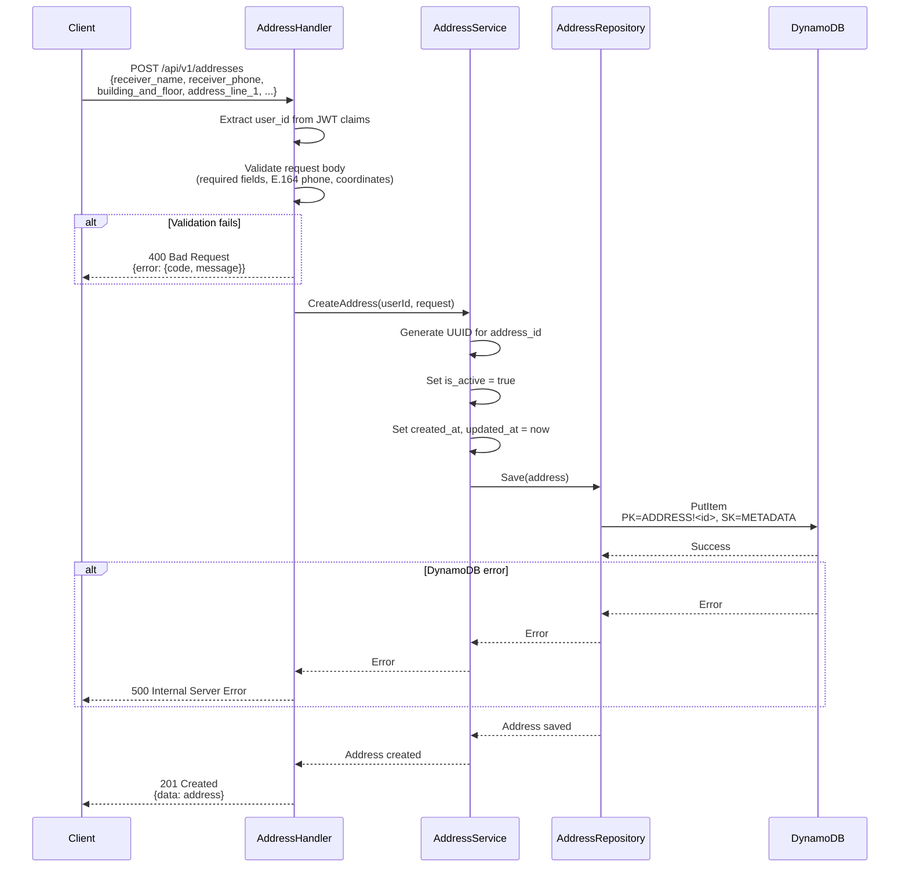
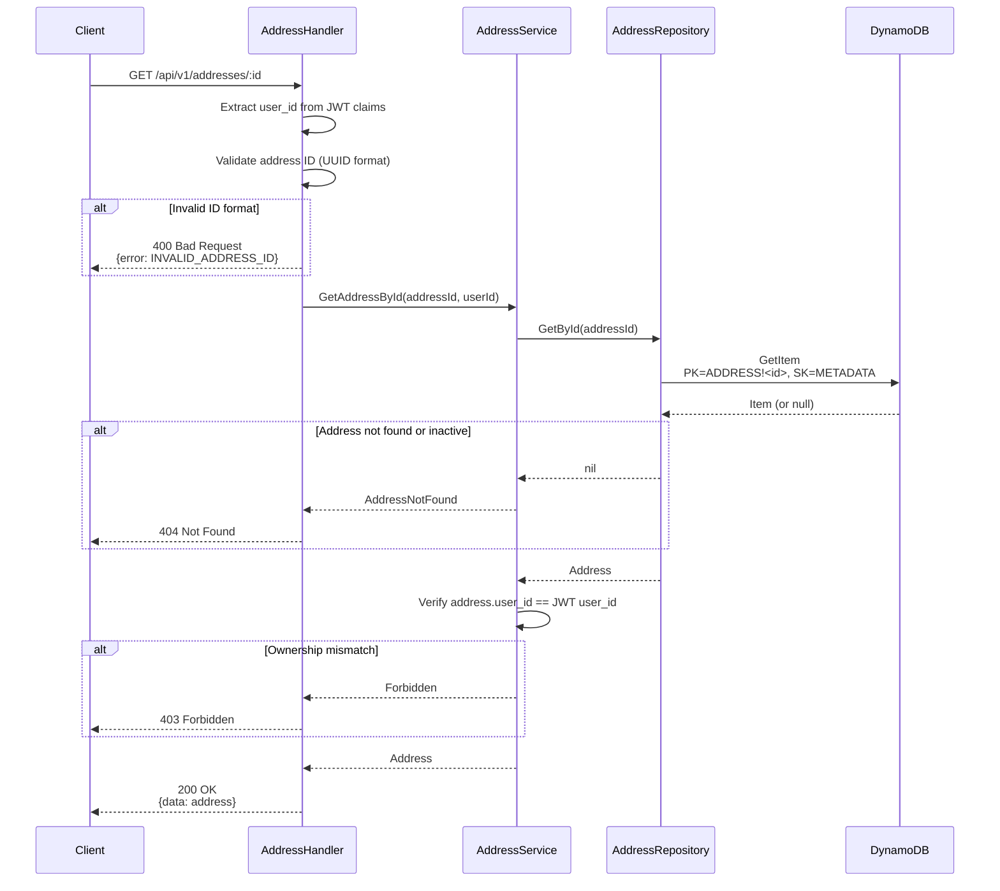
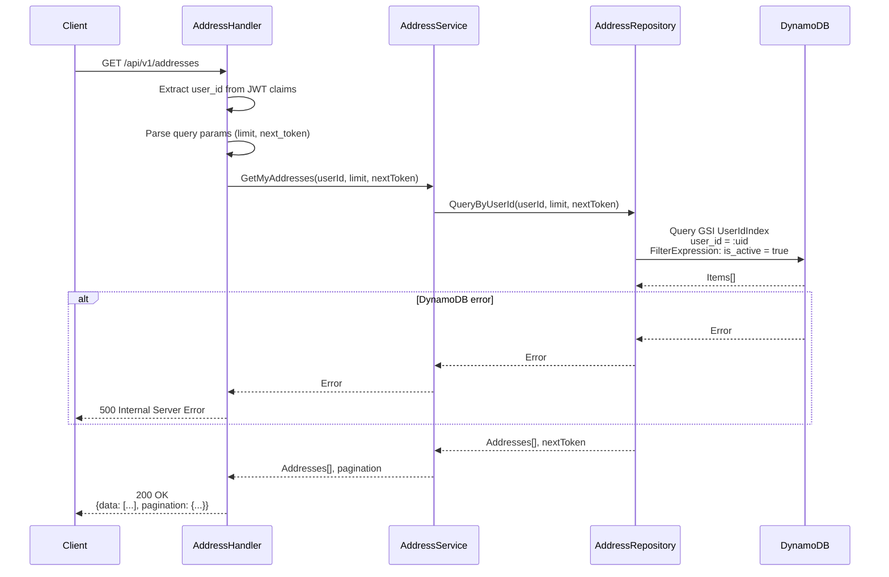
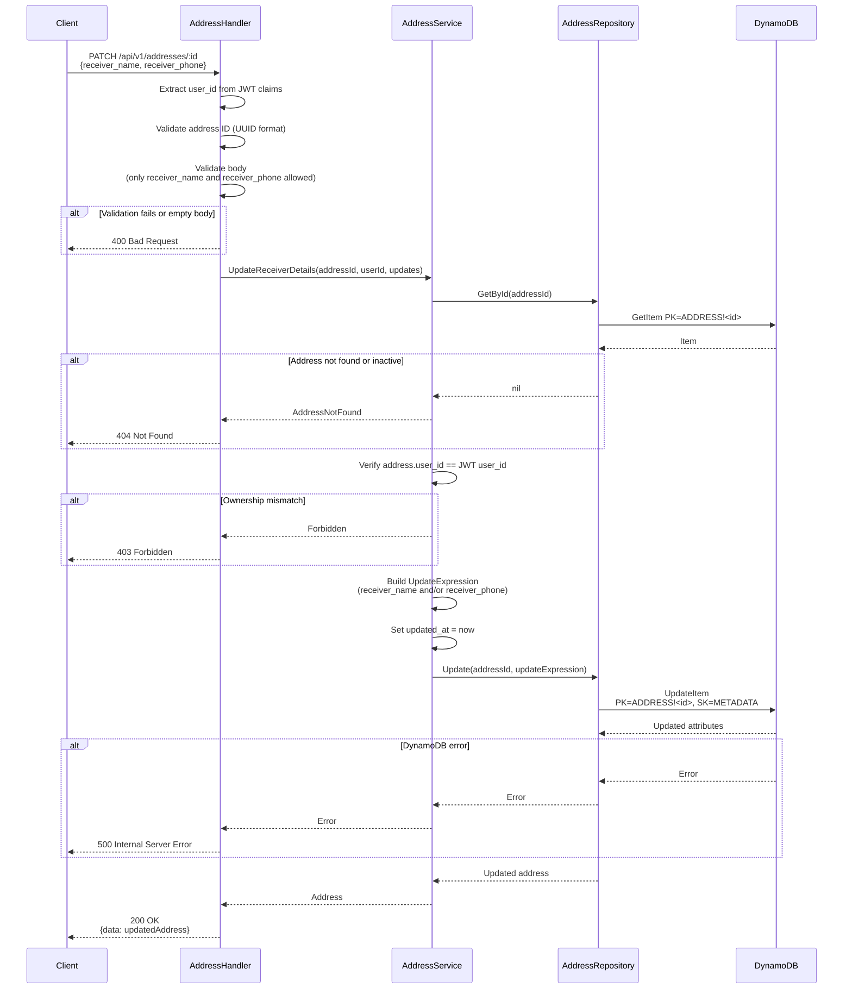
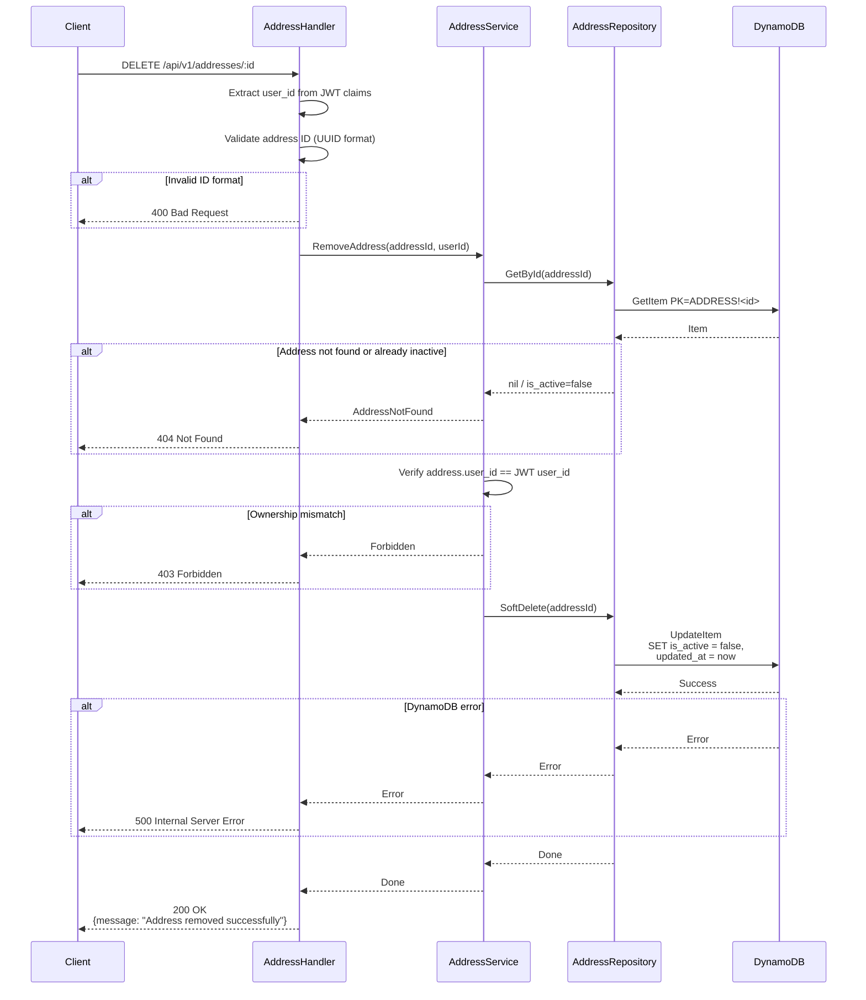
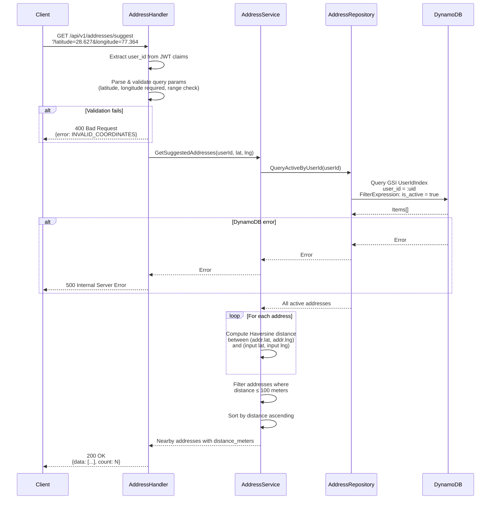

# Address Service — Design Document

**Service:** QCom Platform  
**Author:** Engineering Team  
**Date:** April 2026  
**Status:** Proposed

---

## Table of Contents

1. [Problem Statement](#1-problem-statement)
2. [Proposed Solution](#2-proposed-solution)
3. [Design Decisions](#3-design-decisions)
4. [DynamoDB Schema](#4-dynamodb-schema)
5. [API Contract](#5-api-contract)
6. [Flow Diagrams](#6-flow-diagrams)
7. [Error Catalogue](#7-error-catalogue)
8. [Security Considerations](#8-security-considerations)
9. [Future Enhancements](#9-future-enhancements)

---

## 1. Problem Statement

The QCom platform currently has no way to persist user delivery addresses. To enable order placement and delivery workflows, users need the ability to:

- **Save** one or more addresses with structured fields (building/floor, locality, nearby landmark), receiver details (name and phone), and geographic coordinates (latitude/longitude).
- **View** a specific address or all their saved addresses.
- **Edit** receiver details (name and phone number) on an existing address without losing historical data.
- **Remove** an address without permanently deleting data (soft delete), so that historical order references remain intact.

### Goals

| # | Goal |
|---|------|
| G1 | Provide a structured address form with three line items: **Building & Floor**, **Locality (Address Line 1)**, and **Nearby (Address Line 2)** |
| G2 | Capture **receiver name** and **receiver phone** for each address |
| G3 | Store latitude/longitude alongside every address for geo-based features |
| G4 | Support multiple addresses per user |
| G5 | Soft-delete addresses to preserve referential integrity with past orders |
| G6 | Fit into the existing **single-table DynamoDB** design used by the platform |

### Non-Goals

- Geocoding / reverse-geocoding (will be handled by a separate service).
- Address verification or auto-complete.
- Setting a default address (can be added later).
- Pin code / zip code (not required; coordinates serve as the geographic identifier).

---

## 2. Proposed Solution

### 2.1 High-Level Architecture

```
┌─────────────┐         ┌────────────────────────┐         ┌───────────────────────────────┐
│   Client    │────────▶│      Go Server          │────────▶│          DynamoDB              │
│  (Mobile /  │  REST   │  ┌──────────────────┐   │         │  ┌─────────────────────────┐   │
│   Web)      │◀────────│  │ AddressHandlers  │   │         │  │      QComTable           │   │
└─────────────┘   JSON  │  └───────┬──────────┘   │         │  │                         │   │
                        │          │               │         │  │  PK: ADDRESS!<addr_id>  │   │
                        │  ┌───────▼──────────┐   │         │  │  SK: METADATA            │   │
                        │  │ AddressService   │   │         │  │                         │   │
                        │  └───────┬──────────┘   │         │  │  GSI: UserIdIndex        │   │
                        │          │               │         │  │    PK: user_id           │   │
                        │  ┌───────▼──────────┐   │         │  │    SK: created_at         │   │
                        │  │ AddressRepository│   │         │  └─────────────────────────┘   │
                        │  └──────────────────┘   │         └───────────────────────────────┘
                        └────────────────────────┘
```

### 2.2 Layered Design

The service follows the same **Handler → Service → Repository** pattern already established in the codebase.

| Layer | Responsibility |
|-------|---------------|
| **Handler** (`address_handlers.go`) | HTTP request/response handling, input validation, auth extraction |
| **Service** (`address_service.go`) | Business logic — ownership checks, soft-delete toggling, receiver-detail updates |
| **Repository** (`address_repository.go`) | DynamoDB CRUD operations via aws-sdk-go-v2 |
| **Model** (`address.go`) | Data structure with DynamoDB and JSON tags |

### 2.3 API Summary

All endpoints extract the authenticated user's identity from the **JWT Bearer token** in the `Authorization` header. No user ID is passed in the URL path.

| Method | Endpoint | Description | Auth |
|--------|----------|-------------|------|
| `GET` | `/api/v1/addresses/:id` | Get address by ID | Yes |
| `GET` | `/api/v1/addresses` | Get all addresses for the authenticated user | Yes |
| `GET` | `/api/v1/addresses/suggest?latitude=&longitude=` | Get nearby saved addresses within 100m | Yes |
| `POST` | `/api/v1/addresses` | Create a new address | Yes |
| `PATCH` | `/api/v1/addresses/:id` | Update receiver details only (name & phone) | Yes |
| `DELETE` | `/api/v1/addresses/:id` | Soft-delete (deactivate) an address | Yes |

---

## 3. Design Decisions

### 3.1 Why PATCH Only Updates Receiver Details

**Problem:** If a user places an order for *Flat 402, Tower B* and then edits that address to *Flat 201, Tower A*, the historical order record would point to a location that no longer matches the original delivery.

**Decision:** The `PATCH` endpoint is intentionally restricted to **`receiver_name`** and **`receiver_phone`** only. These are the only fields that can change without affecting the physical location of a past delivery.

For any change to location fields (`building_and_floor`, `address_line_1`, `address_line_2`, `latitude`, `longitude`, `label`), the client must **create a new address**. This guarantees that every order's `address_id` always points to the exact location where the delivery was made.

### 3.2 Why No Pin Code

Geographic coordinates (`latitude`, `longitude`) already uniquely identify the delivery location. Pin code adds no value for routing or geo-based features and would be redundant metadata that the client would need to collect and validate.

### 3.3 Why No Address Cap

There is no hard limit on the number of active addresses per user. The expected usage pattern (personal delivery addresses) naturally self-limits. If abuse is observed in the future, a cap can be introduced without schema changes — it would be a service-layer validation.

### 3.4 Suggested Address — In-Memory Haversine Filtering

The Suggest API fetches **all** active addresses for the user from DynamoDB and then filters/sorts in-memory using the Haversine formula. This is efficient because:

- A single user is expected to have a small number of addresses (typically < 20).
- DynamoDB cannot natively perform geo-distance queries, and introducing a geo-index (e.g., geohash-based) would be over-engineering for this scale.
- The 100-meter radius threshold is applied in the service layer after computing each distance, keeping the repository layer simple.

If per-user address counts grow significantly in the future, a geohash prefix filter can be added at the DynamoDB query level to reduce the in-memory working set.

### 3.5 User Identity From JWT Only

All endpoints derive the user's identity from the JWT claims in the `Authorization` header. There is no `userId` path parameter in any endpoint. Ownership is enforced by comparing the JWT's `user_id` claim against the `user_id` stored on the address record.

---

## 4. DynamoDB Schema

### 4.1 Table Details

This service reuses the existing **`QComTable`** following the single-table design.

| Property | Value |
|----------|-------|
| **Table Name** | `QComTable` |
| **Partition Key (PK)** | `String` |
| **Sort Key (SK)** | `String` |
| **Billing Mode** | `PAY_PER_REQUEST` |
| **TTL Attribute** | `TTL` (not used for addresses) |

### 4.2 Address Item Schema

```
PK:  ADDRESS!<address_id>       ← Partition Key
SK:  METADATA                   ← Sort Key
```

| Attribute | Type | Description |
|-----------|------|-------------|
| `PK` | `S` | `ADDRESS!<uuid>` |
| `SK` | `S` | `METADATA` |
| `address_id` | `S` | UUID v4 — unique identifier |
| `user_id` | `S` | UUID of the owning user |
| `receiver_name` | `S` | Name of the person receiving the delivery |
| `receiver_phone` | `S` | Phone number of the receiver (E.164 format) |
| `building_and_floor` | `S` | Building name / floor / house number |
| `address_line_1` | `S` | Locality |
| `address_line_2` | `S` | Nearby landmark (optional) |
| `latitude` | `N` | Latitude coordinate |
| `longitude` | `N` | Longitude coordinate |
| `label` | `S` | User-defined label — `home`, `work`, `other` (optional) |
| `is_active` | `BOOL` | `true` = active, `false` = soft-deleted |
| `created_at` | `S` | ISO 8601 timestamp |
| `updated_at` | `S` | ISO 8601 timestamp |

### 4.3 Global Secondary Index (GSI)

To fetch all addresses belonging to a user, a GSI is required.

| Property | Value |
|----------|-------|
| **Index Name** | `UserIdIndex` |
| **Partition Key** | `user_id` (`S`) |
| **Sort Key** | `created_at` (`S`) |
| **Projection** | `ALL` |

#### Query Pattern

```
GSI: UserIdIndex
KeyConditionExpression:  user_id = :uid
FilterExpression:        is_active = :true
```

This returns all active addresses for a user, sorted by creation date.

### 4.4 Access Patterns

| Access Pattern | Key Condition | Index |
|---------------|---------------|-------|
| Get address by ID | `PK = ADDRESS!<id>`, `SK = METADATA` | Table (primary) |
| Get all addresses by user | `user_id = <userId>` | `UserIdIndex` (GSI) |
| Suggest addresses near a lat/lng | `user_id = <userId>` + in-memory Haversine filter | `UserIdIndex` (GSI) |
| Create address | `PutItem` with `PK = ADDRESS!<id>` | Table (primary) |
| Update receiver details | `UpdateItem` on `PK = ADDRESS!<id>` | Table (primary) |
| Soft-delete address | `UpdateItem` — set `is_active = false` | Table (primary) |

### 4.5 GSI Creation Script

```bash
aws dynamodb update-table \
  --table-name QComTable \
  --attribute-definitions \
    AttributeName=user_id,AttributeType=S \
    AttributeName=created_at,AttributeType=S \
  --global-secondary-index-updates '[
    {
      "Create": {
        "IndexName": "UserIdIndex",
        "KeySchema": [
          {"AttributeName": "user_id", "KeyType": "HASH"},
          {"AttributeName": "created_at", "KeyType": "RANGE"}
        ],
        "Projection": {"ProjectionType": "ALL"}
      }
    }
  ]' \
  --region us-east-1
```

### 4.6 Sample DynamoDB Item

```json
{
  "PK":                { "S": "ADDRESS!a1b2c3d4-e5f6-7890-abcd-ef1234567890" },
  "SK":                { "S": "METADATA" },
  "address_id":        { "S": "a1b2c3d4-e5f6-7890-abcd-ef1234567890" },
  "user_id":           { "S": "f47ac10b-58cc-4372-a567-0e02b2c3d479" },
  "receiver_name":     { "S": "Shivang Awasthi" },
  "receiver_phone":    { "S": "+919876543210" },
  "building_and_floor":{ "S": "Tower B, 4th Floor, Flat 402" },
  "address_line_1":    { "S": "Sector 62, Noida" },
  "address_line_2":    { "S": "Near City Centre Metro Station" },
  "latitude":          { "N": "28.627235" },
  "longitude":         { "N": "77.364715" },
  "label":             { "S": "home" },
  "is_active":         { "BOOL": true },
  "created_at":        { "S": "2026-04-04T10:30:00Z" },
  "updated_at":        { "S": "2026-04-04T10:30:00Z" }
}
```

---

## 5. API Contract

All endpoints are prefixed with `/api/v1` and require a valid JWT Bearer token in the `Authorization` header. The authenticated user's `user_id` is extracted from the JWT claims — no user ID is passed in the URL.

### Common Headers

```
Authorization: Bearer <access_token>
Content-Type: application/json
```

### Common Error Response Shape

```json
{
  "error": {
    "code": "ERROR_CODE",
    "message": "Human-readable description"
  }
}
```

---

### 5.1 Create Address

**`POST /api/v1/addresses`**

Creates a new address for the authenticated user.

#### Request Body

```json
{
  "receiver_name": "Shivang Awasthi",
  "receiver_phone": "+919876543210",
  "building_and_floor": "Tower B, 4th Floor, Flat 402",
  "address_line_1": "Sector 62, Noida",
  "address_line_2": "Near City Centre Metro Station",
  "latitude": 28.627235,
  "longitude": 77.364715,
  "label": "home"
}
```

| Field | Type | Required | Validation |
|-------|------|----------|------------|
| `receiver_name` | `string` | Yes | Max 128 chars |
| `receiver_phone` | `string` | Yes | E.164 format (e.g., `+919876543210`) |
| `building_and_floor` | `string` | Yes | Max 256 chars |
| `address_line_1` | `string` | Yes | Max 256 chars |
| `address_line_2` | `string` | No | Max 256 chars |
| `latitude` | `float64` | Yes | -90 to +90 |
| `longitude` | `float64` | Yes | -180 to +180 |
| `label` | `string` | No | One of: `home`, `work`, `other`. Defaults to `other` |

#### Success Response — `201 Created`

```json
{
  "data": {
    "address_id": "a1b2c3d4-e5f6-7890-abcd-ef1234567890",
    "user_id": "f47ac10b-58cc-4372-a567-0e02b2c3d479",
    "receiver_name": "Shivang Awasthi",
    "receiver_phone": "+919876543210",
    "building_and_floor": "Tower B, 4th Floor, Flat 402",
    "address_line_1": "Sector 62, Noida",
    "address_line_2": "Near City Centre Metro Station",
    "latitude": 28.627235,
    "longitude": 77.364715,
    "label": "home",
    "is_active": true,
    "created_at": "2026-04-04T10:30:00Z",
    "updated_at": "2026-04-04T10:30:00Z"
  }
}
```

#### Error Responses

| Status | Code | Message | When |
|--------|------|---------|------|
| `400` | `INVALID_REQUEST` | Invalid request body | Malformed JSON |
| `400` | `MISSING_FIELD` | `<field>` is required | Required field missing |
| `400` | `INVALID_PHONE` | Invalid receiver phone number format | Non-E.164 phone |
| `400` | `INVALID_COORDINATES` | Latitude must be between -90 and 90 | Out-of-range lat/lng |
| `400` | `INVALID_LABEL` | Label must be one of: home, work, other | Invalid label value |
| `401` | `UNAUTHORIZED` | Invalid or missing token | No/bad JWT |
| `500` | `ADDRESS_CREATION_FAILED` | Failed to create address | DynamoDB write error |

---

### 5.2 Get Address by ID

**`GET /api/v1/addresses/:id`**

Retrieves a single address by its ID. The address must belong to the authenticated user (verified via JWT).

#### Path Parameters

| Parameter | Type | Description |
|-----------|------|-------------|
| `id` | `string` | UUID of the address |

#### Success Response — `200 OK`

```json
{
  "data": {
    "address_id": "a1b2c3d4-e5f6-7890-abcd-ef1234567890",
    "user_id": "f47ac10b-58cc-4372-a567-0e02b2c3d479",
    "receiver_name": "Shivang Awasthi",
    "receiver_phone": "+919876543210",
    "building_and_floor": "Tower B, 4th Floor, Flat 402",
    "address_line_1": "Sector 62, Noida",
    "address_line_2": "Near City Centre Metro Station",
    "latitude": 28.627235,
    "longitude": 77.364715,
    "label": "home",
    "is_active": true,
    "created_at": "2026-04-04T10:30:00Z",
    "updated_at": "2026-04-04T10:30:00Z"
  }
}
```

#### Error Responses

| Status | Code | Message | When |
|--------|------|---------|------|
| `400` | `INVALID_ADDRESS_ID` | Invalid address ID format | Non-UUID path param |
| `401` | `UNAUTHORIZED` | Invalid or missing token | No/bad JWT |
| `403` | `FORBIDDEN` | You do not own this address | JWT user_id ≠ address user_id |
| `404` | `ADDRESS_NOT_FOUND` | Address not found | ID doesn't exist or is inactive |
| `500` | `INTERNAL_ERROR` | Failed to retrieve address | DynamoDB read error |

---

### 5.3 Get My Addresses

**`GET /api/v1/addresses`**

Retrieves all **active** addresses for the authenticated user. The user ID is extracted from the JWT — no path parameter needed.

#### Query Parameters (Optional)

| Parameter | Type | Default | Description |
|-----------|------|---------|-------------|
| `limit` | `int` | `20` | Max number of addresses to return |
| `next_token` | `string` | — | Pagination cursor from previous response |

#### Success Response — `200 OK`

```json
{
  "data": [
    {
      "address_id": "a1b2c3d4-e5f6-7890-abcd-ef1234567890",
      "user_id": "f47ac10b-58cc-4372-a567-0e02b2c3d479",
      "receiver_name": "Shivang Awasthi",
      "receiver_phone": "+919876543210",
      "building_and_floor": "Tower B, 4th Floor, Flat 402",
      "address_line_1": "Sector 62, Noida",
      "address_line_2": "Near City Centre Metro Station",
      "latitude": 28.627235,
      "longitude": 77.364715,
      "label": "home",
      "is_active": true,
      "created_at": "2026-04-04T10:30:00Z",
      "updated_at": "2026-04-04T10:30:00Z"
    },
    {
      "address_id": "b2c3d4e5-f6a7-8901-bcde-f12345678901",
      "user_id": "f47ac10b-58cc-4372-a567-0e02b2c3d479",
      "receiver_name": "Rahul Sharma",
      "receiver_phone": "+919123456789",
      "building_and_floor": "House No. 12",
      "address_line_1": "MG Road, Gurugram",
      "address_line_2": "",
      "latitude": 28.459497,
      "longitude": 77.026638,
      "label": "work",
      "is_active": true,
      "created_at": "2026-04-03T08:15:00Z",
      "updated_at": "2026-04-03T08:15:00Z"
    }
  ],
  "pagination": {
    "next_token": null,
    "count": 2
  }
}
```

#### Error Responses

| Status | Code | Message | When |
|--------|------|---------|------|
| `401` | `UNAUTHORIZED` | Invalid or missing token | No/bad JWT |
| `500` | `INTERNAL_ERROR` | Failed to retrieve addresses | DynamoDB query error |

---

### 5.4 Update Receiver Details (PATCH)

**`PATCH /api/v1/addresses/:id`**

Updates **only the receiver details** (`receiver_name` and/or `receiver_phone`) on an existing address. Location fields cannot be changed — the client must create a new address instead. See [Section 3.1](#31-why-patch-only-updates-receiver-details) for the rationale.

#### Path Parameters

| Parameter | Type | Description |
|-----------|------|-------------|
| `id` | `string` | UUID of the address |

#### Request Body (at least one field required)

```json
{
  "receiver_name": "Rahul Sharma",
  "receiver_phone": "+919123456789"
}
```

| Field | Type | Validation |
|-------|------|------------|
| `receiver_name` | `string` | Max 128 chars |
| `receiver_phone` | `string` | E.164 format |

#### Success Response — `200 OK`

```json
{
  "data": {
    "address_id": "a1b2c3d4-e5f6-7890-abcd-ef1234567890",
    "user_id": "f47ac10b-58cc-4372-a567-0e02b2c3d479",
    "receiver_name": "Rahul Sharma",
    "receiver_phone": "+919123456789",
    "building_and_floor": "Tower B, 4th Floor, Flat 402",
    "address_line_1": "Sector 62, Noida",
    "address_line_2": "Near City Centre Metro Station",
    "latitude": 28.627235,
    "longitude": 77.364715,
    "label": "home",
    "is_active": true,
    "created_at": "2026-04-04T10:30:00Z",
    "updated_at": "2026-04-04T11:45:00Z"
  }
}
```

#### Error Responses

| Status | Code | Message | When |
|--------|------|---------|------|
| `400` | `INVALID_ADDRESS_ID` | Invalid address ID format | Non-UUID path param |
| `400` | `INVALID_REQUEST` | Invalid request body | Malformed JSON |
| `400` | `EMPTY_UPDATE` | At least one field must be provided | Empty body |
| `400` | `INVALID_PHONE` | Invalid receiver phone number format | Non-E.164 phone |
| `401` | `UNAUTHORIZED` | Invalid or missing token | No/bad JWT |
| `403` | `FORBIDDEN` | You do not own this address | JWT user_id ≠ address user_id |
| `404` | `ADDRESS_NOT_FOUND` | Address not found | ID doesn't exist or is inactive |
| `500` | `ADDRESS_UPDATE_FAILED` | Failed to update address | DynamoDB write error |

---

### 5.5 Remove Address (Soft Delete)

**`DELETE /api/v1/addresses/:id`**

Deactivates an address by setting `is_active = false`. The data is retained in DynamoDB for historical reference. The address must belong to the authenticated user (verified via JWT).

#### Path Parameters

| Parameter | Type | Description |
|-----------|------|-------------|
| `id` | `string` | UUID of the address |

#### Success Response — `200 OK`

```json
{
  "message": "Address removed successfully"
}
```

#### Error Responses

| Status | Code | Message | When |
|--------|------|---------|------|
| `400` | `INVALID_ADDRESS_ID` | Invalid address ID format | Non-UUID path param |
| `401` | `UNAUTHORIZED` | Invalid or missing token | No/bad JWT |
| `403` | `FORBIDDEN` | You do not own this address | JWT user_id ≠ address user_id |
| `404` | `ADDRESS_NOT_FOUND` | Address not found | ID doesn't exist or already inactive |
| `500` | `ADDRESS_DELETE_FAILED` | Failed to remove address | DynamoDB write error |

---

### 5.6 Get Suggested Addresses by Lat/Long

**`GET /api/v1/addresses/suggest?latitude=28.627235&longitude=77.364715`**

Returns the authenticated user's saved addresses that are **within 100 meters** of the provided coordinates, sorted by distance (nearest first). This enables the client to auto-suggest a previously saved address when the user's current location is close to one.

**How it works:**

1. Extract `user_id` from JWT (set by auth interceptor in context).
2. Query all **active** addresses for the user via the `UserIdIndex` GSI.
3. For each address, compute the [Haversine distance](https://en.wikipedia.org/wiki/Haversine_formula) between the address's stored lat/long and the provided lat/long.
4. Filter to only addresses where distance **≤ 100 meters**.
5. Sort the results by distance in ascending order.
6. Return the filtered list with the computed `distance_meters` included in each item.

#### Query Parameters

| Parameter | Type | Required | Validation |
|-----------|------|----------|------------|
| `latitude` | `float64` | Yes | -90 to +90 |
| `longitude` | `float64` | Yes | -180 to +180 |

#### Success Response — `200 OK`

```json
{
  "data": [
    {
      "address_id": "a1b2c3d4-e5f6-7890-abcd-ef1234567890",
      "user_id": "f47ac10b-58cc-4372-a567-0e02b2c3d479",
      "receiver_name": "Shivang Awasthi",
      "receiver_phone": "+919876543210",
      "building_and_floor": "Tower B, 4th Floor, Flat 402",
      "address_line_1": "Sector 62, Noida",
      "address_line_2": "Near City Centre Metro Station",
      "latitude": 28.627235,
      "longitude": 77.364715,
      "label": "home",
      "is_active": true,
      "created_at": "2026-04-04T10:30:00Z",
      "updated_at": "2026-04-04T10:30:00Z",
      "distance_meters": 12.4
    },
    {
      "address_id": "c3d4e5f6-a7b8-9012-cdef-123456789012",
      "user_id": "f47ac10b-58cc-4372-a567-0e02b2c3d479",
      "receiver_name": "Shivang Awasthi",
      "receiver_phone": "+919876543210",
      "building_and_floor": "Tower C, Ground Floor",
      "address_line_1": "Sector 62, Noida",
      "address_line_2": "Near Starbucks",
      "latitude": 28.627400,
      "longitude": 77.364900,
      "label": "other",
      "is_active": true,
      "created_at": "2026-03-20T14:00:00Z",
      "updated_at": "2026-03-20T14:00:00Z",
      "distance_meters": 67.8
    }
  ],
  "count": 2
}
```

If no addresses are within 100 meters, the response returns an empty list:

```json
{
  "data": [],
  "count": 0
}
```

#### Error Responses

| Status | Code | Message | When |
|--------|------|---------|------|
| `400` | `MISSING_FIELD` | latitude is required | Query param missing |
| `400` | `INVALID_COORDINATES` | Latitude must be between -90 and 90 | Out-of-range lat/lng |
| `401` | `UNAUTHORIZED` | Invalid or missing token | No/bad JWT |
| `500` | `INTERNAL_ERROR` | Failed to retrieve addresses | DynamoDB query error |

---

## 6. Flow Diagrams

### 6.1 Create Address



### 6.2 Get Address by ID



### 6.3 Get My Addresses



### 6.4 Update Receiver Details (PATCH)



### 6.5 Remove Address (Soft Delete)



### 6.6 Get Suggested Addresses by Lat/Long



---

## 7. Error Catalogue

A consolidated reference of all error codes used across the Address Service APIs.

| HTTP Status | Code | Message | Applicable APIs |
|-------------|------|---------|----------------|
| `400` | `INVALID_REQUEST` | Invalid request body | Create, Update |
| `400` | `MISSING_FIELD` | `<field>` is required | Create, Suggest |
| `400` | `INVALID_PHONE` | Invalid receiver phone number format | Create, Update |
| `400` | `INVALID_COORDINATES` | Latitude must be between -90 and 90 | Create, Suggest |
| `400` | `INVALID_LABEL` | Label must be one of: home, work, other | Create |
| `400` | `INVALID_ADDRESS_ID` | Invalid address ID format | Get by ID, Update, Delete |
| `400` | `EMPTY_UPDATE` | At least one field must be provided | Update |
| `401` | `UNAUTHORIZED` | Invalid or missing token | All |
| `403` | `FORBIDDEN` | You do not own this address | Get by ID, Update, Delete |
| `404` | `ADDRESS_NOT_FOUND` | Address not found | Get by ID, Update, Delete |
| `500` | `ADDRESS_CREATION_FAILED` | Failed to create address | Create |
| `500` | `ADDRESS_UPDATE_FAILED` | Failed to update address | Update |
| `500` | `ADDRESS_DELETE_FAILED` | Failed to remove address | Delete |
| `500` | `INTERNAL_ERROR` | Failed to retrieve address(es) | Get by ID, Get My Addresses, Suggest |

---

## 8. Security Considerations

| Concern | Mitigation |
|---------|-----------|
| **Authentication** | All endpoints require a valid JWT Bearer token (existing auth middleware) |
| **Authorization** | Every operation verifies that the JWT's `user_id` matches the `user_id` on the address record — prevents IDOR attacks |
| **No userId in URL** | User identity comes exclusively from JWT, not from path or query parameters — eliminates parameter tampering |
| **Input validation** | Coordinates are range-checked, phone is E.164-validated, strings are length-limited, label is enum-validated |
| **Immutable location** | PATCH only allows receiver detail changes; location fields are immutable after creation — preserves order history |
| **Soft delete** | Data is never physically removed; `is_active = false` preserves audit trail and order references |
| **No PII in logs** | Address details and phone numbers are not logged; only address IDs appear in structured logs |

---

## 9. Future Enhancements

| Enhancement | Description |
|-------------|-------------|
| **Default address** | Add an `is_default` boolean to mark one address as the default per user |
| **Geocoding integration** | Auto-fill `address_line_1` from lat/lng via a geocoding service |
| **Address auto-complete** | Integrate with Google Places or Mapbox for address suggestions on the client |
| **Full-text search** | Add an OpenSearch integration for address search across the platform (admin use case) |

---

## Appendix A: Go Model Definition

```go
package models

import "math"

type Address struct {
    AddressID        string  `json:"address_id"         dynamodbav:"address_id"`
    UserID           string  `json:"user_id"            dynamodbav:"user_id"`
    ReceiverName     string  `json:"receiver_name"      dynamodbav:"receiver_name"`
    ReceiverPhone    string  `json:"receiver_phone"     dynamodbav:"receiver_phone"`
    BuildingAndFloor string  `json:"building_and_floor" dynamodbav:"building_and_floor"`
    AddressLine1     string  `json:"address_line_1"     dynamodbav:"address_line_1"`
    AddressLine2     string  `json:"address_line_2"     dynamodbav:"address_line_2,omitempty"`
    Latitude         float64 `json:"latitude"           dynamodbav:"latitude"`
    Longitude        float64 `json:"longitude"          dynamodbav:"longitude"`
    Label            string  `json:"label"              dynamodbav:"label,omitempty"`
    IsActive         bool    `json:"is_active"          dynamodbav:"is_active"`
    CreatedAt        string  `json:"created_at"         dynamodbav:"created_at"`
    UpdatedAt        string  `json:"updated_at"         dynamodbav:"updated_at"`
}

// SuggestedAddress wraps Address with the computed distance for the Suggest API response.
type SuggestedAddress struct {
    Address
    DistanceMeters float64 `json:"distance_meters"`
}

func (a *Address) GetPK() string {
    return "ADDRESS!" + a.AddressID
}

func (a *Address) GetSK() string {
    return "METADATA"
}

const earthRadiusMeters = 6_371_000

// HaversineDistance returns the great-circle distance in meters
// between two (lat, lng) points on Earth.
func HaversineDistance(lat1, lng1, lat2, lng2 float64) float64 {
    dLat := degreesToRadians(lat2 - lat1)
    dLng := degreesToRadians(lng2 - lng1)

    lat1Rad := degreesToRadians(lat1)
    lat2Rad := degreesToRadians(lat2)

    a := math.Sin(dLat/2)*math.Sin(dLat/2) +
        math.Cos(lat1Rad)*math.Cos(lat2Rad)*
            math.Sin(dLng/2)*math.Sin(dLng/2)

    c := 2 * math.Atan2(math.Sqrt(a), math.Sqrt(1-a))
    return earthRadiusMeters * c
}

func degreesToRadians(deg float64) float64 {
    return deg * math.Pi / 180
}
```

## Appendix B: Updated Table Creation Script

```bash
#!/bin/bash
# Add GSI for Address Service — run after table exists

TABLE_NAME="${DYNAMODB_TABLE_NAME:-QComTable}"
ENDPOINT="${DYNAMODB_ENDPOINT:-http://localhost:8000}"
REGION="${DYNAMODB_REGION:-us-east-1}"

echo "Adding UserIdIndex GSI to $TABLE_NAME..."

aws dynamodb update-table \
  --table-name "$TABLE_NAME" \
  --attribute-definitions \
    AttributeName=user_id,AttributeType=S \
    AttributeName=created_at,AttributeType=S \
  --global-secondary-index-updates '[
    {
      "Create": {
        "IndexName": "UserIdIndex",
        "KeySchema": [
          {"AttributeName": "user_id", "KeyType": "HASH"},
          {"AttributeName": "created_at", "KeyType": "RANGE"}
        ],
        "Projection": {"ProjectionType": "ALL"}
      }
    }
  ]' \
  --endpoint-url "$ENDPOINT" \
  --region "$REGION" \
  --no-cli-pager

echo "GSI created successfully!"
```

## Appendix C: Sample curl Commands

```bash
# Create address
curl -X POST http://localhost:8080/api/v1/addresses \
  -H "Authorization: Bearer <token>" \
  -H "Content-Type: application/json" \
  -d '{
    "receiver_name": "Shivang Awasthi",
    "receiver_phone": "+919876543210",
    "building_and_floor": "Tower B, 4th Floor, Flat 402",
    "address_line_1": "Sector 62, Noida",
    "address_line_2": "Near City Centre Metro Station",
    "latitude": 28.627235,
    "longitude": 77.364715,
    "label": "home"
  }'

# Get address by ID (ownership verified via JWT)
curl -X GET http://localhost:8080/api/v1/addresses/<address_id> \
  -H "Authorization: Bearer <token>"

# Get all my addresses (user derived from JWT)
curl -X GET http://localhost:8080/api/v1/addresses \
  -H "Authorization: Bearer <token>"

# Suggest nearby saved addresses (within 100m of given lat/lng)
curl -X GET "http://localhost:8080/api/v1/addresses/suggest?latitude=28.627235&longitude=77.364715" \
  -H "Authorization: Bearer <token>"

# Update receiver details only
curl -X PATCH http://localhost:8080/api/v1/addresses/<address_id> \
  -H "Authorization: Bearer <token>" \
  -H "Content-Type: application/json" \
  -d '{
    "receiver_name": "Rahul Sharma",
    "receiver_phone": "+919123456789"
  }'

# Soft-delete (ownership verified via JWT)
curl -X DELETE http://localhost:8080/api/v1/addresses/<address_id> \
  -H "Authorization: Bearer <token>"
```
