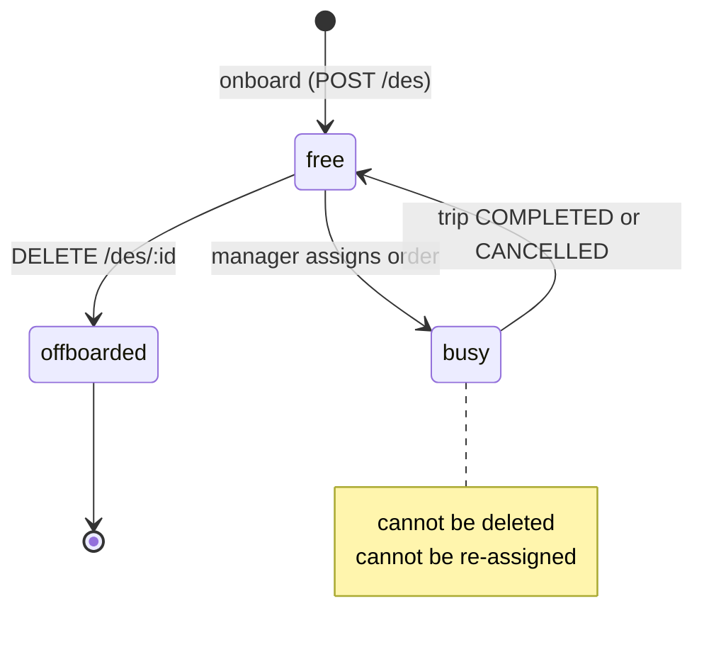
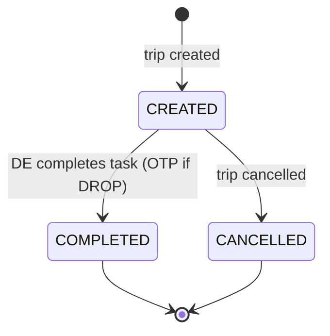
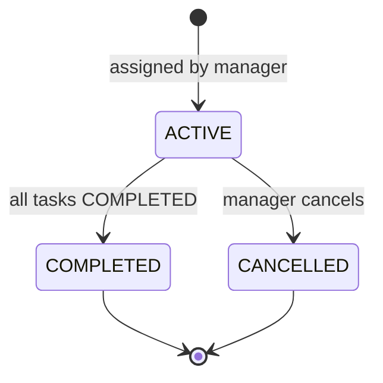
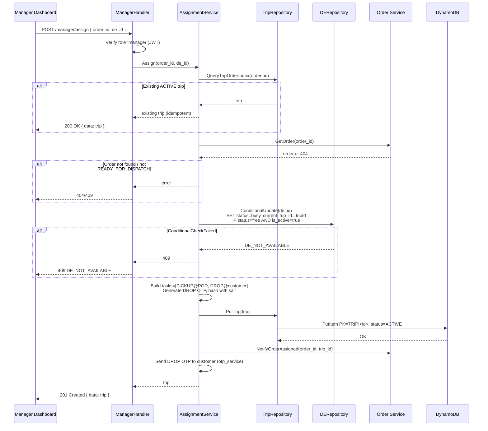
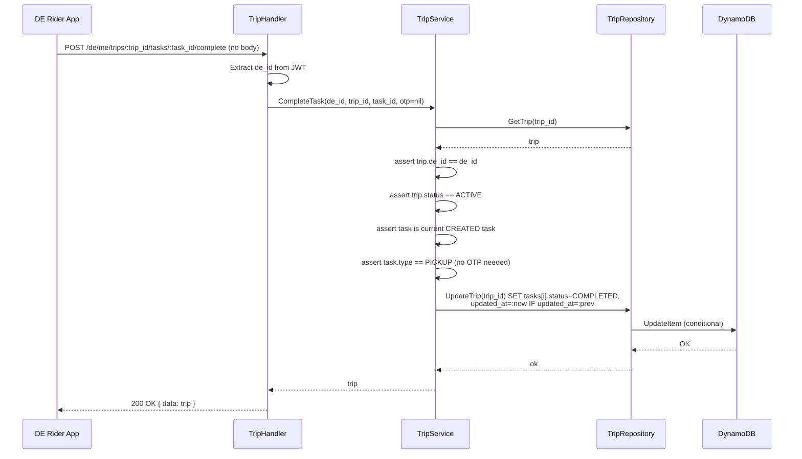
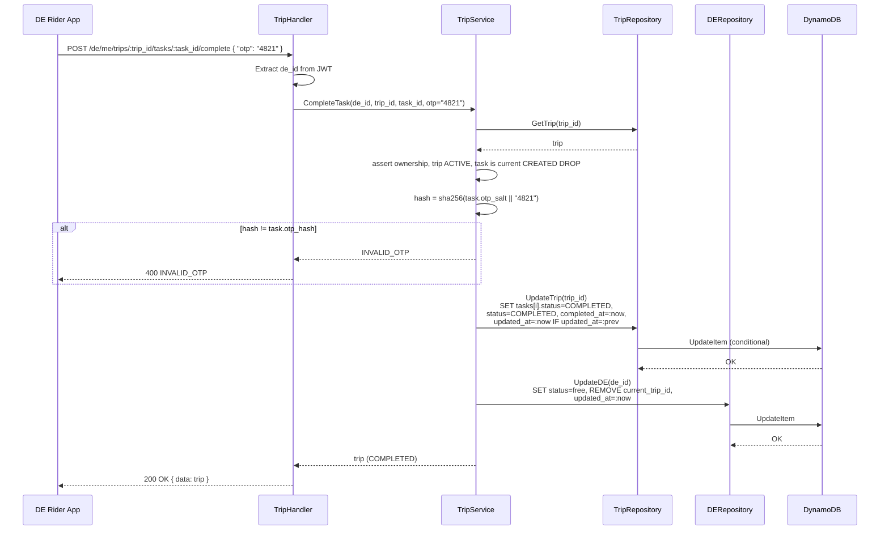
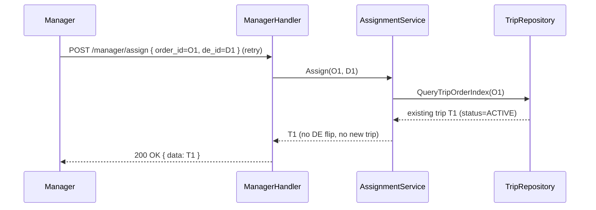

# Logistics Platform (DE + Trip) — Design Document

**Service:** QCom Platform — Logistics v0
**Author:** Engineering Team
**Date:** April 2026
**Status:** Proposed

---

## Table of Contents

1. [Problem Statement](#1-problem-statement)
2. [Proposed Solution](#2-proposed-solution)
3. [Design Decisions](#3-design-decisions)
4. [Domain Model & State Machines](#4-domain-model--state-machines)
5. [DynamoDB Schema](#5-dynamodb-schema)
6. [API Contract](#6-api-contract)
7. [Flow Diagrams](#7-flow-diagrams)
8. [Concurrency & Consistency](#8-concurrency--consistency)
9. [Error Catalogue](#9-error-catalogue)
10. [Security Considerations](#10-security-considerations)
11. [Future Enhancements](#11-future-enhancements)
12. [Appendix A: Go Model Sketches](#appendix-a-go-model-sketches)
13. [Appendix B: GSI Creation Script](#appendix-b-gsi-creation-script)
14. [Appendix C: Sample curl Commands](#appendix-c-sample-curl-commands)

---

## 1. Problem Statement

The QCom platform can place orders today, but has **no logistics layer** to physically fulfill them. We need to introduce a minimal, human-in-the-loop logistics platform around two first-class entities:

- **Delivery Executive (DE)** — the rider who picks up an order from the dark store (POD) and delivers it to the customer.
- **Trip** — a logical container of ordered tasks (`PICKUP`, `DROP`) that a DE performs to fulfill one order.

This v0 explicitly **does not** include auto-assignment. The platform currently operates **one dark store**, and a **store manager** will manually assign each incoming order to a free DE from a dashboard. The system's job is to:

1. Provide CRUD APIs for **DE hiring & onboarding**.
2. On a manager-driven assign call, **create a Trip** with the correct `[PICKUP, DROP]` task sequence and **lock the DE as busy**.
3. Let the DE progress through tasks from the rider app, completing the **DROP** with a customer **OTP**.
4. Free the DE up automatically when the trip is complete.

### 1.1 Goals

| #  | Goal                                                                                                  |
|----|--------------------------------------------------------------------------------------------------------|
| G1 | CRUD APIs to onboard, view, update and offboard a Delivery Executive                                   |
| G2 | A `status = free | busy` lifecycle on each DE that the system enforces atomically                      |
| G3 | A manager dashboard contract: list **free DEs**, list **unassigned orders**, and **assign** an order   |
| G4 | On assign, automatically create a Trip with an immutable `[PICKUP, DROP]` task sequence                |
| G5 | A DE rider-app contract: fetch current trip, complete each task (DROP requires OTP)                    |
| G6 | Idempotent assign — replaying `(order_id, de_id)` returns the same trip, never duplicates              |
| G7 | Reuse the existing **single-table DynamoDB** design and `Handler → Service → Repository` layout        |

### 1.2 Non-Goals

- Auto-assignment / scoring / ML-based dispatch.
- Batched (multi-order, multi-drop) trips.
- Multi-POD routing — only one dark store exists in v0.
- Live GPS tracking, ETA prediction, or geofencing.
- Pickup OTP — the store manager is physically present at the POD and verifies handoff.
- Payouts, incentives, or SLA tracking.
- Building the Order entity itself — Order Service is treated as an upstream system.

---

## 2. Proposed Solution

### 2.1 High-Level Architecture

```
┌──────────────────┐    ┌──────────────────┐    ┌──────────────────┐
│  Manager         │    │  DE Rider App    │    │  HR / Admin      │
│  Dashboard (Web) │    │  (Mobile)        │    │  Console         │
└────────┬─────────┘    └────────┬─────────┘    └────────┬─────────┘
         │ JWT (manager)         │ JWT (de)              │ JWT (admin)
         ▼                       ▼                       ▼
┌─────────────────────────────────────────────────────────────────────┐
│                      QCom Go Server                                  │
│                                                                      │
│  ┌──────────────────┐  ┌──────────────────┐  ┌──────────────────┐    │
│  │ DEHandlers       │  │ ManagerHandlers  │  │ TripHandlers     │    │
│  └────────┬─────────┘  └────────┬─────────┘  └────────┬─────────┘    │
│           │                     │                     │              │
│           ▼                     ▼                     ▼              │
│  ┌──────────────────┐  ┌──────────────────┐  ┌──────────────────┐    │
│  │ DEService        │  │ AssignmentSvc    │  │ TripService      │    │
│  └────────┬─────────┘  └────────┬─────────┘  └────────┬─────────┘    │
│           │                     │                     │              │
│           ▼                     ▼                     ▼              │
│  ┌──────────────────┐                       ┌──────────────────┐     │
│  │ DERepository     │◀──────────────────────│ TripRepository   │     │
│  └────────┬─────────┘                       └────────┬─────────┘     │
└───────────┼──────────────────────────────────────────┼───────────────┘
            ▼                                          ▼
                          ┌──────────────────────┐
                          │     QComTable        │
                          │   (single-table)     │
                          │                      │
                          │  PK: DE!<de_id>      │
                          │  PK: TRIP!<trip_id>  │
                          │                      │
                          │  GSIs:               │
                          │   DeStatusIndex      │
                          │   DeCurrentTripIndex │
                          │   TripOrderIndex     │
                          │   TripDeIndex        │
                          └──────────────────────┘

      ▲ (read-only contract)
      │
┌─────┴─────────────┐
│  Order Service    │   provides: order_id, customer snapshot,
│  (upstream)       │             drop address, items summary
└───────────────────┘
```

### 2.2 Layered Design

Mirrors the existing `Handler → Service → Repository` pattern already used in [`internal/handlers/`](../internal/handlers/), [`internal/service/`](../internal/service/), and [`internal/repository/`](../internal/repository/).

| Layer          | New File(s)                                                                                                | Responsibility                                                          |
|----------------|------------------------------------------------------------------------------------------------------------|--------------------------------------------------------------------------|
| **Model**      | `internal/models/delivery_executive.go`, `internal/models/trip.go`                                         | Structs with `dynamodbav`/`json` tags, `GetPK`/`GetSK` helpers           |
| **Repository** | `internal/repository/de_repository.go`, `internal/repository/trip_repository.go`                           | DynamoDB CRUD via `aws-sdk-go-v2`                                       |
| **Service**    | `internal/service/de_service.go`, `internal/service/trip_service.go`, `internal/service/assignment_service.go` | Business rules, state-machine guards, OTP hashing/validation             |
| **Handler**    | `internal/handlers/de_handlers.go`, `internal/handlers/manager_handlers.go`, `internal/handlers/trip_handlers.go` | HTTP I/O, validation, JWT/role extraction                                |

### 2.3 API Surface — at a glance

| Group              | Method | Endpoint                                       | Caller          |
|--------------------|--------|------------------------------------------------|-----------------|
| **DE CRUD**        | POST   | `/api/v1/des`                                  | admin           |
| (HR / onboarding)  | GET    | `/api/v1/des/:de_id`                           | admin / manager |
|                    | GET    | `/api/v1/des`                                  | admin / manager |
|                    | PATCH  | `/api/v1/des/:de_id`                           | admin           |
|                    | DELETE | `/api/v1/des/:de_id`                           | admin           |
| **Manager**        | GET    | `/api/v1/manager/des/free?pod_id=`             | manager         |
| (dashboard)        | GET    | `/api/v1/manager/orders/unassigned?pod_id=`    | manager         |
|                    | POST   | `/api/v1/manager/assign`                       | manager         |
| **DE Rider App**   | GET    | `/api/v1/de/me/trip`                           | de              |
|                    | POST   | `/api/v1/de/me/trips/:trip_id/tasks/:task_id/complete` | de       |

---

## 3. Design Decisions

### 3.1 Manual Assignment in v0 (Human-in-the-Loop)

**Decision:** No auto-assignment. The store manager picks the DE.

**Why:** With one POD and low daily volume, manager judgement (who is physically nearest, who just finished a trip, who knows that locality) outperforms any heuristic we could ship in v0. The architecture keeps the **assignment service** as a clear seam that we can later swap with a scoring engine — the API contract `POST /manager/assign` stays the same; only the caller changes (manager dashboard → dispatcher service).

### 3.2 `gov_id` is Stored as a Masked Reference, Not Raw

**Problem:** During onboarding we need to capture a government ID (Aadhaar / PAN) to satisfy KYC, but we should not store the raw value — it is sensitive PII and a regulatory liability.

**Decision:** The DE record stores **`gov_id_last4`** (for human display) and **`gov_id_hash`** (SHA-256 of the full ID + a per-DE salt, for de-duplication and verification). The raw ID is **never persisted** by this service; if KYC verification is needed it is delegated to a dedicated KYC vault outside this design.

```
POST /des  body: { "gov_id": "XXXX-XXXX-1234" }
             │
             ▼
   stored:   gov_id_last4 = "1234"
             gov_id_hash  = sha256(salt || raw)
             (raw discarded after the request)
```

### 3.3 DROP-only OTP

**Decision:** Only the **DROP** task carries an OTP. The **PICKUP** task completes via a button tap by the DE inside the rider app.

**Why:**
- The store manager is **physically present** at the POD when the DE picks up — handoff is verified in person.
- The customer is **not present** when the DE arrives at their door (in the abstract sense — no shared trust); an OTP shared by the customer to the DE is the canonical proof of delivery.
- Halves SMS cost and removes one source of friction.

OTP is a 4-digit numeric code, generated server-side at trip-creation time, **stored as a salted SHA-256 hash** on the task, and surfaced to the customer via the existing OTP/notification channel (the platform already has [`internal/service/otp_service.go`](../internal/service/otp_service.go) we can reuse for delivery).

### 3.4 Tasks are Embedded in the Trip Item (not Separate Rows)

**Decision:** A Trip's `tasks[]` list is stored **as a list attribute on the Trip item**, not as individual DynamoDB rows.

**Why:**
- v0 has at most 2 tasks per trip — well under DynamoDB's 400 KB item limit.
- Reads are **single GetItem**; updates are **single UpdateItem** — naturally atomic, no transactions needed.
- The schema is forward-compatible: a future "batched" trip with N tasks remains a list; only when N grows beyond ~50 (multi-drop) would we split tasks into their own rows.

### 3.5 Atomic Free → Busy Transition via Conditional Update

**Problem:** Two managers (or a double-click) could try to assign two different orders to the same DE within milliseconds.

**Decision:** The assignment service issues a **DynamoDB conditional `UpdateItem`** on the DE row:

```
UpdateItem PK=DE!<de_id>, SK=METADATA
  SET status = :busy, current_trip_id = :tripId, updated_at = :now
  ConditionExpression: status = :free AND is_active = :true
```

If the condition fails (`ConditionalCheckFailedException`), the API returns `409 DE_NOT_AVAILABLE`. The Trip row is **only written after** the DE flip succeeds, guaranteeing the invariant **at most one active trip per DE**.

### 3.6 Idempotent Assign via `TripOrderIndex` GSI

**Decision:** Before doing the DE flip, the service queries the `TripOrderIndex` GSI by `order_id`. If a non-cancelled trip already exists for that order, the **existing trip is returned with `200 OK`** instead of creating a new one. This makes the assign endpoint safe to retry on network failures.

### 3.7 Order Entity is Owned Upstream

**Decision:** This service does not own Orders. The assign endpoint accepts an `order_id` and pulls a **denormalized snapshot** (customer name, masked phone, drop address, items summary) from the Order Service and stores it on the Trip. Subsequent reads (DE app, manager dashboard) do **not** require a cross-service call to render a trip — the snapshot is what the DE sees.

If the customer later updates their address mid-flight, the trip continues to deliver to the originally-snapshotted address (matches the immutability rationale already established in [docs/ADDRESS_SERVICE_DESIGN.md](ADDRESS_SERVICE_DESIGN.md) §3.1).

### 3.8 One Active Trip per DE — Enforced by Invariant + Index

**Decision:** A DE can have at most one active trip at a time. Enforced by:
1. The conditional update in §3.5 (DE must be `free` to be assigned).
2. A sparse GSI `DeCurrentTripIndex` (`PK = de_id`, only present when `current_trip_id != null`) to look up "what is this DE currently doing" in O(1).

When the trip's last task completes, the trip service **clears `current_trip_id`** and flips DE status back to `free` in a single `UpdateItem`.

### 3.9 Soft-Delete (Offboard) for DE; Hard-Delete is Refused if Busy

**Decision:** `DELETE /des/:de_id` is a **soft delete** — sets `is_active = false`. This preserves the historical link between past trips and the DE who ran them. The call is **rejected with `409 DE_BUSY_CANNOT_DELETE`** if the DE has an active trip.

---

## 4. Domain Model & State Machines

### 4.1 Delivery Executive State Machine



| Status        | Meaning                                                         |
|---------------|-----------------------------------------------------------------|
| `free`        | On-duty and available for assignment                            |
| `busy`        | Currently has an active trip                                    |
| `offboarded`  | `is_active = false` — soft-deleted, no longer assignable        |

### 4.2 Task State Machine



### 4.3 Trip State Machine



A trip transitions to `COMPLETED` **only** when the last task in `tasks[]` is marked `COMPLETED` (enforced in `TripService.CompleteTask`).

---

## 5. DynamoDB Schema

This service extends the existing **`QComTable`** single-table design.

### 5.1 DE Item

```
PK:  DE!<de_id>            ← Partition Key
SK:  METADATA              ← Sort Key
```

| Attribute          | Type   | Description                                                              |
|--------------------|--------|--------------------------------------------------------------------------|
| `PK`               | `S`    | `DE!<uuid>`                                                              |
| `SK`               | `S`    | `METADATA`                                                               |
| `de_id`            | `S`    | UUID v4                                                                  |
| `name`             | `S`    | Full legal name                                                          |
| `phone`            | `S`    | E.164 — used for rider-app login                                         |
| `gov_id_last4`     | `S`    | Last 4 chars of gov ID (for display)                                     |
| `gov_id_hash`      | `S`    | `sha256(salt || raw_gov_id)` — for de-duplication; raw never stored      |
| `pod_id`           | `S`    | Dark store this DE is attached to (single value in v0: `POD-001`)        |
| `status`           | `S`    | `free` \| `busy`                                                         |
| `is_active`        | `BOOL` | `true` = on-roster, `false` = offboarded                                 |
| `current_trip_id`  | `S`    | Sparse — present only while `status = busy`                              |
| `created_at`       | `S`    | ISO 8601                                                                 |
| `updated_at`       | `S`    | ISO 8601                                                                 |

### 5.2 Trip Item

```
PK:  TRIP!<trip_id>        ← Partition Key
SK:  METADATA              ← Sort Key
```

| Attribute            | Type   | Description                                                    |
|----------------------|--------|----------------------------------------------------------------|
| `PK`                 | `S`    | `TRIP!<uuid>`                                                  |
| `SK`                 | `S`    | `METADATA`                                                     |
| `trip_id`            | `S`    | UUID v4                                                        |
| `de_id`              | `S`    | The assigned DE                                                |
| `order_id`           | `S`    | Upstream order reference                                       |
| `pod_id`             | `S`    | Dark store of pickup                                           |
| `status`             | `S`    | `ACTIVE` \| `COMPLETED` \| `CANCELLED`                         |
| `tasks`              | `L`    | Ordered list of task maps (see §5.3)                           |
| `customer_snapshot`  | `M`    | `{ name, phone_masked, drop_address, items_summary }`          |
| `created_at`         | `S`    | ISO 8601                                                       |
| `updated_at`         | `S`    | ISO 8601 — also doubles as optimistic-lock token               |
| `completed_at`       | `S`    | ISO 8601, set on terminal transition                           |

### 5.3 Embedded Task Object

| Attribute       | Type   | Description                                                 |
|-----------------|--------|-------------------------------------------------------------|
| `task_id`       | `S`    | UUID                                                        |
| `type`          | `S`    | `PICKUP` \| `DROP`                                          |
| `sequence`      | `N`    | 1-based order within the trip                               |
| `status`        | `S`    | `CREATED` \| `COMPLETED` \| `CANCELLED`                     |
| `location`      | `M`    | `{ lat, lng, label }` — POD address for PICKUP, drop addr for DROP |
| `otp_hash`      | `S`    | Present only on DROP; `sha256(salt || otp)`                  |
| `otp_salt`      | `S`    | Per-task salt                                               |
| `created_at`    | `S`    | ISO 8601                                                    |
| `completed_at`  | `S`    | ISO 8601 (nullable)                                         |

### 5.4 Global Secondary Indexes

| Index                    | PK                    | SK              | Sparse | Purpose                                                   |
|--------------------------|-----------------------|-----------------|--------|-----------------------------------------------------------|
| `DeStatusIndex`          | `pod_id` (S)          | `status` (S)    | No     | Manager dashboard: list `free` DEs at this POD            |
| `DeCurrentTripIndex`     | `de_id` (S)           | —               | Yes (`current_trip_id`) | "What trip is this DE on?" — DE rider-app fetch          |
| `TripOrderIndex`         | `order_id` (S)        | `status` (S)    | No     | Idempotency check on assign; "trip for order"             |
| `TripDeIndex`            | `de_id` (S)           | `created_at` (S)| No     | Trip history per DE (for HR / future payouts)             |

### 5.5 Access Patterns

| Pattern                                    | Operation       | Index                |
|--------------------------------------------|-----------------|----------------------|
| Get DE by id                               | GetItem         | Table (primary)      |
| Create DE                                  | PutItem         | Table (primary)      |
| Update DE name/phone                       | UpdateItem      | Table (primary)      |
| Soft-delete DE                             | UpdateItem      | Table (primary)      |
| List free DEs at POD                       | Query           | `DeStatusIndex`      |
| List all DEs (paginated, with filters)     | Query/Scan      | `DeStatusIndex`      |
| Atomic free → busy on assign               | UpdateItem (cond) | Table (primary)    |
| Get DE's current trip                      | Query (1 row)   | `DeCurrentTripIndex` |
| Idempotency check on assign                | Query           | `TripOrderIndex`     |
| Get trip by id                             | GetItem         | Table (primary)      |
| Complete a task / trip transition          | UpdateItem (cond on `updated_at`) | Table (primary) |
| Trip history for a DE                      | Query           | `TripDeIndex`        |

### 5.6 Sample DE Item

```json
{
  "PK":               { "S": "DE!8b2b0f0e-2f3e-4f7a-9d2b-1c2a3b4c5d6e" },
  "SK":               { "S": "METADATA" },
  "de_id":            { "S": "8b2b0f0e-2f3e-4f7a-9d2b-1c2a3b4c5d6e" },
  "name":             { "S": "Rahul Verma" },
  "phone":            { "S": "+919812345678" },
  "gov_id_last4":     { "S": "1234" },
  "gov_id_hash":      { "S": "9f86d081884c7d659a2feaa0c55ad015a3bf4f1b2b0b822cd15d6c15b0f00a08" },
  "pod_id":           { "S": "POD-001" },
  "status":           { "S": "busy" },
  "is_active":        { "BOOL": true },
  "current_trip_id":  { "S": "fa1c0b1e-9e0c-4ef2-8c1a-7b6c5d4e3f21" },
  "created_at":       { "S": "2026-04-10T09:00:00Z" },
  "updated_at":       { "S": "2026-04-19T11:42:13Z" }
}
```

### 5.7 Sample Trip Item

```json
{
  "PK":         { "S": "TRIP!fa1c0b1e-9e0c-4ef2-8c1a-7b6c5d4e3f21" },
  "SK":         { "S": "METADATA" },
  "trip_id":    { "S": "fa1c0b1e-9e0c-4ef2-8c1a-7b6c5d4e3f21" },
  "de_id":      { "S": "8b2b0f0e-2f3e-4f7a-9d2b-1c2a3b4c5d6e" },
  "order_id":   { "S": "ORD-2026-04-19-000123" },
  "pod_id":     { "S": "POD-001" },
  "status":     { "S": "ACTIVE" },
  "tasks": {
    "L": [
      { "M": {
          "task_id":   { "S": "t-pickup-uuid" },
          "type":      { "S": "PICKUP" },
          "sequence":  { "N": "1" },
          "status":    { "S": "COMPLETED" },
          "location":  { "M": {
              "lat":   { "N": "28.6275" },
              "lng":   { "N": "77.3650" },
              "label": { "S": "POD-001, Sector 62 Noida" }
          }},
          "created_at":   { "S": "2026-04-19T11:42:13Z" },
          "completed_at": { "S": "2026-04-19T11:48:01Z" }
      }},
      { "M": {
          "task_id":   { "S": "t-drop-uuid" },
          "type":      { "S": "DROP" },
          "sequence":  { "N": "2" },
          "status":    { "S": "CREATED" },
          "location":  { "M": {
              "lat":   { "N": "28.6321" },
              "lng":   { "N": "77.3712" },
              "label": { "S": "Tower B, Flat 402" }
          }},
          "otp_hash": { "S": "b1946ac9...sha256" },
          "otp_salt": { "S": "s3cr3t-salt" },
          "created_at": { "S": "2026-04-19T11:42:13Z" }
      }}
    ]
  },
  "customer_snapshot": { "M": {
      "name":         { "S": "Shivang A." },
      "phone_masked": { "S": "+9198XXXXXX10" },
      "drop_address": { "S": "Tower B, Flat 402, Sector 62 Noida" },
      "items_summary":{ "S": "3 items — Milk, Bread, Eggs" }
  }},
  "created_at":   { "S": "2026-04-19T11:42:13Z" },
  "updated_at":   { "S": "2026-04-19T11:48:01Z" }
}
```

---

## 6. API Contract

All endpoints are prefixed with `/api/v1` and require a JWT Bearer token. The token's `role` claim selects the permitted endpoint group:

| Role       | Can call                                                                                  |
|------------|-------------------------------------------------------------------------------------------|
| `admin`    | All `/des/*` (CRUD), all `/manager/*` (read-only superset)                                |
| `manager`  | All `/manager/*`, read-only `/des/*` (`GET`)                                              |
| `de`       | `/de/me/*` only — and only their own active trip                                          |

### Common Headers

```
Authorization: Bearer <access_token>
Content-Type: application/json
```

### Common Error Envelope

```json
{ "error": { "code": "ERROR_CODE", "message": "Human-readable description" } }
```

---

### 6.1 Create DE (Onboard)

**`POST /api/v1/des`** — `admin`

#### Request Body

```json
{
  "name": "Rahul Verma",
  "phone": "+919812345678",
  "gov_id": "XXXX-XXXX-1234",
  "pod_id": "POD-001"
}
```

| Field    | Type     | Required | Validation                                      |
|----------|----------|----------|-------------------------------------------------|
| `name`   | `string` | Yes      | 1–128 chars                                     |
| `phone`  | `string` | Yes      | E.164, unique across active DEs                 |
| `gov_id` | `string` | Yes      | Aadhaar (12 digits) or PAN (10 alnum) — **discarded after hashing** |
| `pod_id` | `string` | Yes      | Must be a known POD (`POD-001` in v0)           |

#### Success — `201 Created`

```json
{
  "data": {
    "de_id": "8b2b0f0e-...",
    "name": "Rahul Verma",
    "phone": "+919812345678",
    "gov_id_last4": "1234",
    "pod_id": "POD-001",
    "status": "free",
    "is_active": true,
    "created_at": "2026-04-10T09:00:00Z",
    "updated_at": "2026-04-10T09:00:00Z"
  }
}
```

#### Errors

| Status | Code                  | When                                  |
|--------|-----------------------|---------------------------------------|
| 400    | `INVALID_REQUEST`     | Malformed body                        |
| 400    | `MISSING_FIELD`       | Required field missing                |
| 400    | `INVALID_PHONE`       | Non-E.164                             |
| 400    | `INVALID_GOV_ID`      | Not a valid Aadhaar/PAN format        |
| 409    | `DE_PHONE_TAKEN`      | Another active DE has this phone      |
| 401    | `UNAUTHORIZED`        | Missing/bad JWT                       |
| 403    | `FORBIDDEN_ROLE`      | Caller is not `admin`                 |
| 500    | `DE_CREATION_FAILED`  | DynamoDB write error                  |

---

### 6.2 Get DE by ID

**`GET /api/v1/des/:de_id`** — `admin` or `manager`

#### Success — `200 OK`

```json
{ "data": { "de_id": "...", "name": "...", "phone": "...", "status": "free", "...": "..." } }
```

#### Errors

| Status | Code             | When                       |
|--------|------------------|----------------------------|
| 400    | `INVALID_DE_ID`  | Non-UUID path param        |
| 401    | `UNAUTHORIZED`   | Missing/bad JWT            |
| 403    | `FORBIDDEN_ROLE` | Caller role not allowed    |
| 404    | `DE_NOT_FOUND`   | No such (or inactive) DE   |
| 500    | `INTERNAL_ERROR` | DynamoDB read error        |

---

### 6.3 List DEs

**`GET /api/v1/des`** — `admin` or `manager`

#### Query Parameters

| Param        | Type     | Default | Description                      |
|--------------|----------|---------|----------------------------------|
| `pod_id`     | `string` | —       | Filter by POD                    |
| `status`     | `string` | —       | `free` \| `busy`                 |
| `is_active`  | `bool`   | `true`  | Include offboarded DEs           |
| `limit`      | `int`    | `20`    | Max results                      |
| `next_token` | `string` | —       | Pagination cursor                |

#### Success — `200 OK`

```json
{
  "data": [ { "de_id": "...", "...": "..." } ],
  "pagination": { "next_token": null, "count": 12 }
}
```

---

### 6.4 Update DE

**`PATCH /api/v1/des/:de_id`** — `admin`

Only `name` and `phone` are mutable. `gov_id_*`, `de_id`, `pod_id`, `status` are immutable via this endpoint.

#### Request Body

```json
{ "name": "Rahul V.", "phone": "+919812345679" }
```

#### Errors

| Status | Code             | When                                                |
|--------|------------------|-----------------------------------------------------|
| 400    | `EMPTY_UPDATE`   | Empty body                                          |
| 400    | `INVALID_PHONE`  | Non-E.164                                           |
| 409    | `DE_PHONE_TAKEN` | Phone already used by another active DE             |
| 404    | `DE_NOT_FOUND`   | DE missing/inactive                                 |
| 403    | `FORBIDDEN_ROLE` | Caller is not `admin`                               |

---

### 6.5 Offboard DE (Soft Delete)

**`DELETE /api/v1/des/:de_id`** — `admin`

Sets `is_active = false`. **Refused** if DE is currently `busy`.

#### Success — `200 OK`

```json
{ "message": "DE offboarded successfully" }
```

#### Errors

| Status | Code                      | When                                            |
|--------|---------------------------|-------------------------------------------------|
| 404    | `DE_NOT_FOUND`            | DE missing or already offboarded                |
| 409    | `DE_BUSY_CANNOT_DELETE`   | DE has an active trip                           |
| 403    | `FORBIDDEN_ROLE`          | Caller is not `admin`                           |

---

### 6.6 Manager Dashboard — List Free DEs

**`GET /api/v1/manager/des/free?pod_id=POD-001`** — `manager`

Backed by `DeStatusIndex` (`pod_id = :pod AND status = :free`).

#### Success — `200 OK`

```json
{
  "data": [
    { "de_id": "...", "name": "Rahul Verma", "phone": "+919812345678", "status": "free" },
    { "de_id": "...", "name": "Sneha Kapoor","phone": "+919876543210", "status": "free" }
  ],
  "count": 2
}
```

---

### 6.7 Manager Dashboard — List Unassigned Orders

**`GET /api/v1/manager/orders/unassigned?pod_id=POD-001`** — `manager`

This endpoint is a **proxy/projection** over the upstream Order Service. The logistics service queries the Order Service for orders in state `READY_FOR_DISPATCH` at the given POD that have no entry in `TripOrderIndex` (or whose existing trip is `CANCELLED`).

#### Success — `200 OK`

```json
{
  "data": [
    {
      "order_id": "ORD-2026-04-19-000123",
      "customer_name": "Shivang A.",
      "drop_address": "Tower B, Flat 402, Sector 62 Noida",
      "items_count": 3,
      "ready_at": "2026-04-19T11:40:55Z"
    }
  ],
  "count": 1
}
```

---

### 6.8 Manager Dashboard — Assign Order to DE

**`POST /api/v1/manager/assign`** — `manager`

This is the heart of v0. Atomically: validates, locks DE, creates trip with `[PICKUP, DROP]`, generates DROP OTP, dispatches OTP to customer.

#### Request Body

```json
{ "order_id": "ORD-2026-04-19-000123", "de_id": "8b2b0f0e-..." }
```

#### Success — `201 Created` (or `200 OK` on idempotent replay)

```json
{
  "data": {
    "trip_id": "fa1c0b1e-...",
    "de_id":   "8b2b0f0e-...",
    "order_id":"ORD-2026-04-19-000123",
    "status":  "ACTIVE",
    "tasks": [
      { "task_id":"...", "type":"PICKUP", "sequence":1, "status":"CREATED" },
      { "task_id":"...", "type":"DROP",   "sequence":2, "status":"CREATED" }
    ],
    "customer_snapshot": { "name":"Shivang A.", "phone_masked":"+9198XXXXXX10", "...":"..." },
    "created_at": "2026-04-19T11:42:13Z"
  }
}
```

#### Errors

| Status | Code                       | When                                                                |
|--------|----------------------------|---------------------------------------------------------------------|
| 400    | `INVALID_REQUEST`          | Malformed body / missing field                                      |
| 404    | `DE_NOT_FOUND`             | DE missing/inactive                                                 |
| 404    | `ORDER_NOT_FOUND`          | Order Service has no such order                                     |
| 409    | `DE_NOT_AVAILABLE`         | DE is `busy` (conditional update failed)                            |
| 409    | `ORDER_ALREADY_ASSIGNED`   | A different active trip exists for this order                       |
| 409    | `ORDER_NOT_READY`          | Order is not in `READY_FOR_DISPATCH` state                          |
| 403    | `FORBIDDEN_ROLE`           | Caller is not `manager`                                             |
| 500    | `ASSIGNMENT_FAILED`        | DynamoDB or downstream error (DE flip rolled back)                  |

---

### 6.9 DE Rider App — Get My Active Trip

**`GET /api/v1/de/me/trip`** — `de`

Looks up the trip via `DeCurrentTripIndex` for the JWT's `de_id`. Returns `204 No Content` if no active trip.

#### Success — `200 OK`

```json
{
  "data": {
    "trip_id": "...",
    "status": "ACTIVE",
    "tasks": [
      { "task_id":"...", "type":"PICKUP", "sequence":1, "status":"COMPLETED",
        "location": { "lat":28.6275, "lng":77.3650, "label":"POD-001, Sector 62 Noida" } },
      { "task_id":"...", "type":"DROP",   "sequence":2, "status":"CREATED",
        "location": { "lat":28.6321, "lng":77.3712, "label":"Tower B, Flat 402" } }
    ],
    "customer_snapshot": { "name":"Shivang A.", "phone_masked":"+9198XXXXXX10", "drop_address":"..." }
  }
}
```

> The `otp_hash` and `otp_salt` are **never** returned to the DE app.

---

### 6.10 DE Rider App — Complete a Task

**`POST /api/v1/de/me/trips/:trip_id/tasks/:task_id/complete`** — `de`

#### Request Body

| Task type | Body                  |
|-----------|-----------------------|
| `PICKUP`  | `{}` (no body)        |
| `DROP`    | `{ "otp": "4821" }`   |

#### Behaviour

1. JWT's `de_id` must equal `trip.de_id`, else `403 FORBIDDEN`.
2. Trip must be `ACTIVE`, else `409 TRIP_NOT_ACTIVE`.
3. Task must be the **current `CREATED` task in sequence** (no skipping), else `409 TASK_OUT_OF_ORDER`.
4. If `DROP`: `sha256(salt || otp) == otp_hash`, else `400 INVALID_OTP`.
5. Mark the task `COMPLETED` with `completed_at`. If it's the final task: set trip `status = COMPLETED`, clear DE `current_trip_id`, set DE `status = free` — all in a single `UpdateItem` per row, conditioned on `updated_at` (optimistic lock).

#### Success — `200 OK`

```json
{
  "data": {
    "trip_id": "...",
    "status": "COMPLETED",
    "tasks": [ { "...": "..." }, { "type":"DROP", "status":"COMPLETED", "completed_at":"..." } ]
  }
}
```

#### Errors

| Status | Code                      | When                                             |
|--------|---------------------------|--------------------------------------------------|
| 400    | `INVALID_OTP`             | OTP mismatch on DROP                             |
| 400    | `MISSING_OTP`             | DROP body missing `otp`                          |
| 403    | `FORBIDDEN`               | DE is not the assignee of this trip              |
| 404    | `TRIP_NOT_FOUND`          | Bad `trip_id`                                    |
| 404    | `TASK_NOT_FOUND`          | Bad `task_id`                                    |
| 409    | `TRIP_NOT_ACTIVE`         | Trip is `COMPLETED` or `CANCELLED`               |
| 409    | `TASK_OUT_OF_ORDER`       | Trying to complete a non-current task            |
| 409    | `TASK_ALREADY_COMPLETED`  | Task is already `COMPLETED`                      |
| 500    | `TASK_COMPLETION_FAILED`  | DynamoDB write error                             |

---

## 7. Flow Diagrams

### 7.1 Onboard DE

```mermaid
sequenceDiagram
    participant A as Admin Console
    participant H as DEHandler
    participant S as DEService
    participant R as DERepository
    participant DB as DynamoDB

    A->>H: POST /des { name, phone, gov_id, pod_id }
    H->>H: Verify role=admin (JWT)
    H->>H: Validate body (E.164, gov_id format)
    H->>S: CreateDE(req)
    S->>S: salt = random; gov_id_hash = sha256(salt || raw)
    S->>S: gov_id_last4 = raw[-4:]; discard raw
    S->>R: PutDE(de) with ConditionExpression: attribute_not_exists(PK)
    R->>DB: PutItem PK=DE!<id>, SK=METADATA, status=free, is_active=true
    DB-->>R: OK
    R-->>S: ok
    S-->>H: DE
    H-->>A: 201 Created { data: de }
```

### 7.2 Manager Assigns Order — The Critical Path



> **Failure handling:** if `PutTrip` fails after the DE flip, the assignment service issues a compensating `UpdateItem` to revert the DE back to `free` (best-effort; if compensation also fails, an alert is raised — DE is locked until manual intervention or a TTL-based reconciler clears stale `current_trip_id`).

### 7.3 DE Completes PICKUP



### 7.4 DE Completes DROP (with OTP) → Trip Closes



### 7.5 Idempotent Re-Assign



---

## 8. Concurrency & Consistency

| Scenario                                       | Mechanism                                                                                              |
|------------------------------------------------|--------------------------------------------------------------------------------------------------------|
| Two managers click "Assign" on same DE         | Conditional `UpdateItem` on DE row with `status = free` — second caller gets `DE_NOT_AVAILABLE`        |
| Manager double-submits same `(order, de)`      | `TripOrderIndex` lookup before any write — second call returns existing trip with `200 OK`             |
| DE double-taps "Complete"                      | `UpdateItem` is conditioned on `updated_at = :prev` (optimistic lock) — second update fails silently   |
| DE completes tasks out of order                | `TripService` checks `task.sequence == first(CREATED).sequence` before allowing completion             |
| Trip put fails after DE flipped to busy        | Compensating `UpdateItem` reverts DE to `free`; alert raised if compensation also fails                |
| Stale `current_trip_id` (lost compensation)    | A nightly reconciler scans DEs where `status=busy` whose `current_trip_id` points at a `COMPLETED`/`CANCELLED` trip and clears it |
| Reads of DE's active trip during transition    | `DeCurrentTripIndex` is eventually consistent (~1s); rider app tolerates this — UI shows "Refresh" if empty |

---

## 9. Error Catalogue

| HTTP | Code                       | Used by                                                |
|------|----------------------------|---------------------------------------------------------|
| 400  | `INVALID_REQUEST`          | All write endpoints                                     |
| 400  | `MISSING_FIELD`            | Create DE, Assign                                       |
| 400  | `INVALID_PHONE`            | Create/Update DE                                        |
| 400  | `INVALID_GOV_ID`           | Create DE                                               |
| 400  | `INVALID_DE_ID`            | DE GET / PATCH / DELETE                                 |
| 400  | `EMPTY_UPDATE`             | PATCH DE                                                |
| 400  | `INVALID_OTP`              | Complete DROP                                           |
| 400  | `MISSING_OTP`              | Complete DROP                                           |
| 401  | `UNAUTHORIZED`             | All                                                     |
| 403  | `FORBIDDEN`                | DE attempting to act on another DE's trip               |
| 403  | `FORBIDDEN_ROLE`           | Wrong role for endpoint                                 |
| 404  | `DE_NOT_FOUND`             | DE GET / PATCH / DELETE / Assign                        |
| 404  | `ORDER_NOT_FOUND`          | Assign                                                  |
| 404  | `TRIP_NOT_FOUND`           | DE rider-app endpoints                                  |
| 404  | `TASK_NOT_FOUND`           | Complete task                                           |
| 409  | `DE_PHONE_TAKEN`           | Create / Update DE                                      |
| 409  | `DE_NOT_AVAILABLE`         | Assign                                                  |
| 409  | `DE_BUSY_CANNOT_DELETE`    | DELETE DE                                               |
| 409  | `ORDER_ALREADY_ASSIGNED`   | Assign                                                  |
| 409  | `ORDER_NOT_READY`          | Assign                                                  |
| 409  | `TRIP_NOT_ACTIVE`          | Complete task                                           |
| 409  | `TASK_OUT_OF_ORDER`        | Complete task                                           |
| 409  | `TASK_ALREADY_COMPLETED`   | Complete task                                           |
| 500  | `DE_CREATION_FAILED`       | Create DE                                               |
| 500  | `ASSIGNMENT_FAILED`        | Assign                                                  |
| 500  | `TASK_COMPLETION_FAILED`   | Complete task                                           |
| 500  | `INTERNAL_ERROR`           | All reads                                               |

---

## 10. Security Considerations

| Concern                          | Mitigation                                                                                          |
|----------------------------------|-----------------------------------------------------------------------------------------------------|
| Authentication                   | All endpoints require valid JWT (existing middleware in [`internal/middleware/`](../internal/middleware/)) |
| Authorization (role)             | JWT `role` claim gates each endpoint group (`admin`, `manager`, `de`)                               |
| Authorization (ownership)        | DE endpoints derive `de_id` from JWT; trip writes assert `trip.de_id == jwt.de_id`                  |
| OTP secrecy                      | Never stored or transmitted in plaintext; stored as `sha256(salt || otp)`; not returned in any API  |
| Gov ID PII                       | Raw value never persisted; only `last4` (display) and salted SHA-256 hash (de-dup)                  |
| Customer phone                   | Stored on trip in masked form (`+9198XXXXXX10`); raw remains with Order Service                     |
| Idempotency                      | Assign is idempotent on `order_id`; task completion is idempotent under `updated_at` optimistic lock |
| IDOR                             | No `de_id`/`trip_id` is trusted from the URL alone — JWT comparison enforced server-side             |
| No PII in logs                   | Logs carry `de_id`, `trip_id`, `order_id` only — no phone/name/address/OTP                          |
| Replay protection on OTP         | OTP is single-use: task transitions `CREATED → COMPLETED` on first valid use; further attempts hit `TASK_ALREADY_COMPLETED` |

---

## 11. Future Enhancements

| Enhancement                          | Notes                                                                                       |
|--------------------------------------|----------------------------------------------------------------------------------------------|
| Auto-assignment / scoring            | Replace manager click with a DispatcherService that calls the same `Assign` internal API     |
| Batched (multi-drop) trips           | `tasks[]` already a list; service-layer change to allow N drops; consider splitting tasks into rows beyond N=50 |
| Multi-POD                            | `pod_id` already a first-class field; routing service picks the POD; schema unchanged        |
| Live GPS tracking                    | New `LocationPing` items keyed `PK=DE!<id>, SK=PING!<ts>` with TTL                           |
| PICKUP OTP                           | Add `otp_hash` to PICKUP task — needed when POD becomes unattended (kiosk model)             |
| DE shift management                  | Add `on_shift` boolean and `shift_history`; only `on_shift && free` DEs are assignable       |
| Payouts / SLA tracking               | Aggregate over `TripDeIndex` for per-DE earnings and SLA metrics                             |
| Trip cancellation by manager         | `POST /manager/trips/:id/cancel` — sets trip `CANCELLED`, frees DE, notifies Order Service   |
| Push notifications to DE app         | New trip assigned → FCM/APNS push via existing notification channel                          |

---

## Appendix A: Go Model Sketches

```go
package models

import "time"

// DEStatus is the operational availability of a Delivery Executive.
type DEStatus string

const (
    DEStatusFree DEStatus = "free"
    DEStatusBusy DEStatus = "busy"
)

type DeliveryExecutive struct {
    DEID           string    `json:"de_id"            dynamodbav:"de_id"`
    Name           string    `json:"name"             dynamodbav:"name"`
    Phone          string    `json:"phone"            dynamodbav:"phone"`
    GovIDLast4     string    `json:"gov_id_last4"     dynamodbav:"gov_id_last4"`
    GovIDHash      string    `json:"-"                dynamodbav:"gov_id_hash"`
    PodID          string    `json:"pod_id"           dynamodbav:"pod_id"`
    Status         DEStatus  `json:"status"           dynamodbav:"status"`
    IsActive       bool      `json:"is_active"        dynamodbav:"is_active"`
    CurrentTripID  string    `json:"current_trip_id,omitempty" dynamodbav:"current_trip_id,omitempty"`
    CreatedAt      time.Time `json:"created_at"       dynamodbav:"created_at"`
    UpdatedAt      time.Time `json:"updated_at"       dynamodbav:"updated_at"`
}

func (d *DeliveryExecutive) GetPK() string { return "DE!" + d.DEID }
func (d *DeliveryExecutive) GetSK() string { return "METADATA" }

// ---------------------------------------------------------------------------

type TaskType string
type TaskStatus string
type TripStatus string

const (
    TaskTypePickup TaskType = "PICKUP"
    TaskTypeDrop   TaskType = "DROP"

    TaskStatusCreated   TaskStatus = "CREATED"
    TaskStatusCompleted TaskStatus = "COMPLETED"
    TaskStatusCancelled TaskStatus = "CANCELLED"

    TripStatusActive    TripStatus = "ACTIVE"
    TripStatusCompleted TripStatus = "COMPLETED"
    TripStatusCancelled TripStatus = "CANCELLED"
)

type Location struct {
    Lat   float64 `json:"lat"   dynamodbav:"lat"`
    Lng   float64 `json:"lng"   dynamodbav:"lng"`
    Label string  `json:"label" dynamodbav:"label"`
}

type Task struct {
    TaskID      string     `json:"task_id"               dynamodbav:"task_id"`
    Type        TaskType   `json:"type"                  dynamodbav:"type"`
    Sequence    int        `json:"sequence"              dynamodbav:"sequence"`
    Status      TaskStatus `json:"status"                dynamodbav:"status"`
    Location    Location   `json:"location"              dynamodbav:"location"`
    OTPHash     string     `json:"-"                     dynamodbav:"otp_hash,omitempty"`
    OTPSalt     string     `json:"-"                     dynamodbav:"otp_salt,omitempty"`
    CreatedAt   time.Time  `json:"created_at"            dynamodbav:"created_at"`
    CompletedAt *time.Time `json:"completed_at,omitempty" dynamodbav:"completed_at,omitempty"`
}

type CustomerSnapshot struct {
    Name         string `json:"name"          dynamodbav:"name"`
    PhoneMasked  string `json:"phone_masked"  dynamodbav:"phone_masked"`
    DropAddress  string `json:"drop_address"  dynamodbav:"drop_address"`
    ItemsSummary string `json:"items_summary" dynamodbav:"items_summary"`
}

type Trip struct {
    TripID           string           `json:"trip_id"            dynamodbav:"trip_id"`
    DEID             string           `json:"de_id"              dynamodbav:"de_id"`
    OrderID          string           `json:"order_id"           dynamodbav:"order_id"`
    PodID            string           `json:"pod_id"             dynamodbav:"pod_id"`
    Status           TripStatus       `json:"status"             dynamodbav:"status"`
    Tasks            []Task           `json:"tasks"              dynamodbav:"tasks"`
    CustomerSnapshot CustomerSnapshot `json:"customer_snapshot"  dynamodbav:"customer_snapshot"`
    CreatedAt        time.Time        `json:"created_at"         dynamodbav:"created_at"`
    UpdatedAt        time.Time        `json:"updated_at"         dynamodbav:"updated_at"`
    CompletedAt      *time.Time       `json:"completed_at,omitempty" dynamodbav:"completed_at,omitempty"`
}

func (t *Trip) GetPK() string { return "TRIP!" + t.TripID }
func (t *Trip) GetSK() string { return "METADATA" }
```

---

## Appendix B: GSI Creation Script

```bash
#!/bin/bash
# Add Logistics GSIs to QComTable. Run after the table exists.

TABLE_NAME="${DYNAMODB_TABLE_NAME:-QComTable}"
ENDPOINT="${DYNAMODB_ENDPOINT:-http://localhost:8000}"
REGION="${DYNAMODB_REGION:-us-east-1}"

echo "Adding logistics GSIs to $TABLE_NAME..."

# 1. DeStatusIndex — list free DEs at a POD
aws dynamodb update-table \
  --table-name "$TABLE_NAME" \
  --attribute-definitions \
    AttributeName=pod_id,AttributeType=S \
    AttributeName=status,AttributeType=S \
  --global-secondary-index-updates '[
    {
      "Create": {
        "IndexName": "DeStatusIndex",
        "KeySchema": [
          {"AttributeName": "pod_id", "KeyType": "HASH"},
          {"AttributeName": "status", "KeyType": "RANGE"}
        ],
        "Projection": {"ProjectionType": "ALL"}
      }
    }
  ]' \
  --endpoint-url "$ENDPOINT" --region "$REGION" --no-cli-pager

# 2. DeCurrentTripIndex — sparse, get DE's active trip
aws dynamodb update-table \
  --table-name "$TABLE_NAME" \
  --attribute-definitions \
    AttributeName=de_id,AttributeType=S \
    AttributeName=current_trip_id,AttributeType=S \
  --global-secondary-index-updates '[
    {
      "Create": {
        "IndexName": "DeCurrentTripIndex",
        "KeySchema": [
          {"AttributeName": "de_id", "KeyType": "HASH"},
          {"AttributeName": "current_trip_id", "KeyType": "RANGE"}
        ],
        "Projection": {"ProjectionType": "ALL"}
      }
    }
  ]' \
  --endpoint-url "$ENDPOINT" --region "$REGION" --no-cli-pager

# 3. TripOrderIndex — idempotency lookup on assign
aws dynamodb update-table \
  --table-name "$TABLE_NAME" \
  --attribute-definitions \
    AttributeName=order_id,AttributeType=S \
    AttributeName=status,AttributeType=S \
  --global-secondary-index-updates '[
    {
      "Create": {
        "IndexName": "TripOrderIndex",
        "KeySchema": [
          {"AttributeName": "order_id", "KeyType": "HASH"},
          {"AttributeName": "status", "KeyType": "RANGE"}
        ],
        "Projection": {"ProjectionType": "ALL"}
      }
    }
  ]' \
  --endpoint-url "$ENDPOINT" --region "$REGION" --no-cli-pager

# 4. TripDeIndex — trip history per DE
aws dynamodb update-table \
  --table-name "$TABLE_NAME" \
  --attribute-definitions \
    AttributeName=de_id,AttributeType=S \
    AttributeName=created_at,AttributeType=S \
  --global-secondary-index-updates '[
    {
      "Create": {
        "IndexName": "TripDeIndex",
        "KeySchema": [
          {"AttributeName": "de_id", "KeyType": "HASH"},
          {"AttributeName": "created_at", "KeyType": "RANGE"}
        ],
        "Projection": {"ProjectionType": "ALL"}
      }
    }
  ]' \
  --endpoint-url "$ENDPOINT" --region "$REGION" --no-cli-pager

echo "Logistics GSIs created."
```

---

## Appendix C: Sample curl Commands

```bash
# 1. Onboard a DE (admin)
curl -X POST http://localhost:8080/api/v1/des \
  -H "Authorization: Bearer <admin_token>" \
  -H "Content-Type: application/json" \
  -d '{
    "name": "Rahul Verma",
    "phone": "+919812345678",
    "gov_id": "ABCDE1234F",
    "pod_id": "POD-001"
  }'

# 2. Manager — list free DEs at the POD
curl -X GET "http://localhost:8080/api/v1/manager/des/free?pod_id=POD-001" \
  -H "Authorization: Bearer <manager_token>"

# 3. Manager — list unassigned orders
curl -X GET "http://localhost:8080/api/v1/manager/orders/unassigned?pod_id=POD-001" \
  -H "Authorization: Bearer <manager_token>"

# 4. Manager — assign an order to a DE (creates the trip)
curl -X POST http://localhost:8080/api/v1/manager/assign \
  -H "Authorization: Bearer <manager_token>" \
  -H "Content-Type: application/json" \
  -d '{
    "order_id": "ORD-2026-04-19-000123",
    "de_id":    "8b2b0f0e-2f3e-4f7a-9d2b-1c2a3b4c5d6e"
  }'

# 5. DE — fetch current active trip
curl -X GET http://localhost:8080/api/v1/de/me/trip \
  -H "Authorization: Bearer <de_token>"

# 6. DE — complete PICKUP (no body)
curl -X POST http://localhost:8080/api/v1/de/me/trips/<trip_id>/tasks/<pickup_task_id>/complete \
  -H "Authorization: Bearer <de_token>"

# 7. DE — complete DROP with OTP (closes trip, frees DE)
curl -X POST http://localhost:8080/api/v1/de/me/trips/<trip_id>/tasks/<drop_task_id>/complete \
  -H "Authorization: Bearer <de_token>" \
  -H "Content-Type: application/json" \
  -d '{ "otp": "4821" }'

# 8. Admin — offboard a DE (refused if busy)
curl -X DELETE http://localhost:8080/api/v1/des/<de_id> \
  -H "Authorization: Bearer <admin_token>"
```
