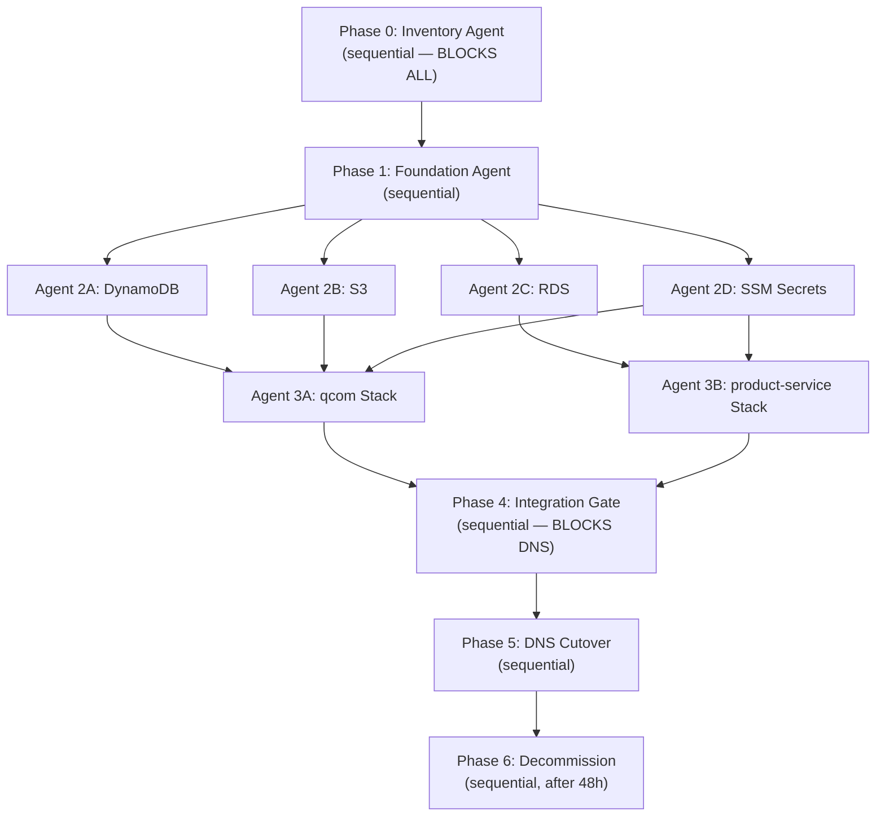

# AWS Account Migration Implementation Plan

> **For agentic workers:** REQUIRED SUB-SKILL: Use superpowers:subagent-driven-development (recommended) or superpowers:executing-plans to implement this plan task-by-task. Steps use checkbox (`- [ ]`) syntax for tracking.

**Goal:** Migrate every AWS resource from old account `119312949433` to the new admin AWS account in `ap-southeast-2`, with zero missed resources and a verifiable cutover checklist.

**Architecture:** Big-bang migration (downtime OK — not live). Phase 0 inventories the old account into a manifest. Phase 1 lays new-account foundation. Phase 2 runs three parallel data-migration agents (DynamoDB, RDS, SSM) — **S3 `printdrop-documents` skipped** (safe to drop, not migrated). Phase 3 runs two parallel compute agents (qcom stack, product-service stack). Phase 4 is a sequential integration gate — nothing proceeds until every check passes. Phase 5 flips DNS. Phase 6 decommissions the old account.

**Tech Stack:** AWS CLI v2, existing qcom scripts (`create-table.sh`, `migrate-dynamodb-region.sh`, `setup-ssm.sh`, `update-dynamodb-iam-policy.sh`, `ec2-bootstrap.sh`, `setup-payment-tls.sh`), Squarespace DNS, GitHub deploy keys.

**Known resources (from repo docs — Phase 0 must confirm/extend):**

| Layer | Old account resources |
|---|---|
| qcom compute | ASG `qcom-asg`, LT `qcom-lt`, EC2 `i-0d5e625a1593765d1` |
| product-service compute | EC2 `i-00dc197caba8ab3eb` (`product-service`, port 8082) |
| Load balancing | ALB `qcom-alb`, TG `qcom-tg`, possibly `payment-*` ALB stack |
| Data | DynamoDB `QComTable`, S3 `printdrop-documents`, RDS (MySQL — confirm ID in Phase 0) |
| Secrets | SSM `/qcom/prod/*` + product-service secrets (confirm path in Phase 0) |
| IAM | `qcom-ec2-role`, `qcom-ec2-profile` |
| SSL | ACM `api.bunzodelivery.com`, possibly `payment.bunzodelivery.com` |
| DNS | Squarespace CNAMEs for `api` and `payment` |
| VPC | `vpc-093b98d73d5d4b393` (default VPC) |

---

## Backward Compatibility Contract (CRITICAL)

**Principle:** Recreate the new account as a clone. At cutover, **only Squarespace DNS CNAMEs change** (`api` → new `qcom-alb` DNS, `payment` → new `payment-alb` DNS). Apps keep calling `api.bunzodelivery.com` and `payment.bunzodelivery.com` — no mobile/web app changes.

### Names that MUST stay identical

| Resource | Name | Why |
|---|---|---|
| DynamoDB table | `QComTable` | Hardcoded default in `config.go` + SSM |
| RDS instance | `quickcommerce` | product-service config |
| RDS database | `inventory` | JDBC URL path |
| RDS master user | `admin` | product-service config |
| ASG | `qcom-asg` | `deploy.sh` / `.deploy.local.env` |
| ALB | `qcom-alb`, `payment-alb` | Operational consistency |
| Target groups | `qcom-tg`, `payment-tg` | Listener rules |
| Launch template | `qcom-lt` | ASG reference |
| IAM | `qcom-ec2-role`, `qcom-ec2-profile` | Bootstrap scripts |
| SSM paths | `/qcom/prod/*` | `fetch-env.sh` prefix |
| SSM values | All identical | Especially `JWT_SECRET_KEY`, `JAVA_ORDER_SERVICE_URL` (keep domain URLs, not ALB DNS) |
| Domains | `api.bunzodelivery.com`, `payment.bunzodelivery.com` | Client-facing — unchanged |
| Listener paths | `/health`, `/api/v1/*` | ALB rules |

### What changes (server-side only — invisible to clients)

| Item | Change | Who updates |
|---|---|---|
| Squarespace CNAME targets | Point to new ALB DNS names | Phase 5 (DNS) |
| RDS endpoint hostname | AWS assigns new host (e.g. `quickcommerce.<newhash>.ap-southeast-2.rds.amazonaws.com`) | product-service JDBC on EC2 only |
| ACM certificate ARNs | New certs in new account, same domains | ALB listeners |
| EC2 instance IDs | New IDs (ASG handles this) | Nobody — apps use domains |

### What we do NOT do

- Rename RDS to `bunzo-product-db` or anything else
- Change DynamoDB table name
- Change SSM parameter names or JWT secret
- Point `JAVA_ORDER_SERVICE_URL` at raw ALB DNS (keep `https://payment.bunzodelivery.com` or whatever is in SSM today)
- Migrate or recreate S3 `printdrop-documents` (dropped)

---

## Execution Model: Parallel Sub-Agents



**Parallelism rules:**
- Phase 0 and Phase 4 are **gates** — no parallel work, all checks must pass.
- Phase 2 agents (2A–2D) run **in parallel** after Phase 1.
- Phase 3 agents (3A, 3B) run **in parallel** after their data dependencies complete.
- Agent 3B must finish RDS connectivity wiring (uses Agent 2C output) before Phase 4.

**Credentials:**
- Old account: `AWS_PROFILE=old` or keys in `.deploy.local.env` (current)
- New account: `AWS_PROFILE=new` or keys in `.deploy.new.env` (create, gitignored)

---

## Files

| Action | Path | Responsibility |
|---|---|---|
| Create | `scripts/migration/00-inventory.sh` | Enumerate all AWS resources in old account |
| Create | `scripts/migration/01-verify-manifest.sh` | Compare old vs new resource counts |
| Create | `scripts/migration/02-migrate-rds.sh` | Snapshot → share → restore RDS cross-account |
| Create | `scripts/migration/03-migrate-s3.sh` | Sync S3 bucket old → new |
| Create | `scripts/migration/04-export-ssm.sh` | Export all SSM params from old account |
| Create | `scripts/migration/05-import-ssm.sh` | Import SSM params into new account |
| Create | `scripts/migration/06-rebuild-qcom-stack.sh` | Recreate IAM + ALB + ASG in new account |
| Create | `scripts/migration/07-rebuild-product-stack.sh` | Recreate product-service EC2 + ALB + RDS wiring |
| Create | `scripts/migration/08-integration-gate.sh` | Run all verification checks |
| Create | `data/migration-manifest.json` | Machine-readable inventory (gitignored — contains resource IDs) |
| Create | `.deploy.new.env.example` | Template for new account credentials |
| Modify | `docs/production-infrastructure.md` | Update account ID and resource ARNs after migration |

---

## Phase 0: Inventory Agent (SEQUENTIAL — must complete first)

**Sub-agent prompt to dispatch:**

```
You are the Inventory Agent for AWS account migration.

Old account: 119312949433, region ap-southeast-2.
Goal: produce data/migration-manifest.json listing EVERY AWS resource.

Run scripts/migration/00-inventory.sh and fill any gaps manually.
Return: the manifest file path + summary table of resource counts.
Do NOT create or delete anything. Read-only only.
```

### Task 0: Create inventory script

**Files:**
- Create: `scripts/migration/00-inventory.sh`

- [ ] **Step 1: Create the script**

```bash
#!/usr/bin/env bash
# Enumerate all AWS resources in the current account/region.
# Usage: AWS_PROFILE=old ./scripts/migration/00-inventory.sh
set -euo pipefail

REGION="${AWS_REGION:-ap-southeast-2}"
OUT="${1:-data/migration-manifest.json}"
mkdir -p "$(dirname "$OUT")"

ACCOUNT_ID=$(aws sts get-caller-identity --query Account --output text)
TS=$(date -u +"%Y-%m-%dT%H:%M:%SZ")

echo "Inventorying account ${ACCOUNT_ID} in ${REGION}..."

# Helper: JSON array from AWS CLI
jarr() { aws "$@" --region "$REGION" --output json 2>/dev/null || echo '[]'; }

cat > "$OUT" <<EOF
{
  "generated_at": "${TS}",
  "old_account_id": "${ACCOUNT_ID}",
  "region": "${REGION}",
  "ec2_instances": $(jarr ec2 describe-instances),
  "auto_scaling_groups": $(jarr autoscaling describe-auto-scaling-groups),
  "launch_templates": $(jarr ec2 describe-launch-templates),
  "load_balancers": $(jarr elbv2 describe-load-balancers),
  "target_groups": $(jarr elbv2 describe-target-groups),
  "listeners": [],
  "dynamodb_tables": $(jarr dynamodb list-tables),
  "dynamodb_table_details": [],
  "s3_buckets": $(jarr s3api list-buckets),
  "rds_instances": $(jarr rds describe-db-instances),
  "rds_clusters": $(jarr rds describe-db-clusters),
  "rds_snapshots": $(jarr rds describe-db-snapshots --snapshot-type manual),
  "ssm_parameters": $(aws ssm get-parameters-by-path --path / --recursive --region "$REGION" --query 'Parameters[*].Name' --output json 2>/dev/null || echo '[]'),
  "iam_roles": $(jarr iam list-roles --query 'Roles[?contains(RoleName, `qcom`) || contains(RoleName, `product`) || contains(RoleName, `payment`)]'),
  "acm_certificates": $(jarr acm list-certificates),
  "security_groups": $(jarr ec2 describe-security-groups),
  "vpcs": $(jarr ec2 describe-vpcs),
  "subnets": $(jarr ec2 describe-subnets),
  "cloudwatch_log_groups": $(jarr logs describe-log-groups),
  "sns_topics": $(jarr sns list-topics),
  "sqs_queues": $(jarr sqs list-queues),
  "lambda_functions": $(jarr lambda list-functions),
  "route53_zones": $(jarr route53 list-hosted-zones),
  "kms_keys": $(jarr kms list-keys)
}
EOF

# Enrich DynamoDB table details
TABLES=$(aws dynamodb list-tables --region "$REGION" --query 'TableNames[]' --output text 2>/dev/null || true)
for t in $TABLES; do
  DETAIL=$(aws dynamodb describe-table --table-name "$t" --region "$REGION" --output json 2>/dev/null || echo '{}')
  # append to manifest (simplified: print reminder)
  echo "  DynamoDB table: $t"
done

echo "Manifest written to ${OUT}"
echo "Review manually for resources not covered by this script."
```

- [ ] **Step 2: Run inventory on old account**

```bash
chmod +x scripts/migration/00-inventory.sh
AWS_PROFILE=old AWS_REGION=ap-southeast-2 ./scripts/migration/00-inventory.sh
```

Expected: `data/migration-manifest.json` created. Review output for RDS instance ID, SSM paths, any extra buckets/Lambdas.

- [ ] **Step 3: Manual inventory checklist (human gate)**

Fill in this table from the manifest before proceeding:

| Resource | Old ID / Name | Migrated in plan? |
|---|---|---|
| qcom ASG | | Agent 3A |
| qcom ALB | | Agent 3A |
| product-service EC2 | | Agent 3B |
| payment ALB (if exists) | | Agent 3B |
| DynamoDB QComTable | | Agent 2A |
| S3 printdrop-documents | | Agent 2B |
| RDS instance | | Agent 2C |
| SSM /qcom/prod/* | | Agent 2D |
| SSM product-service params | | Agent 2D |
| ACM api.bunzodelivery.com | | Agent 3A (re-request) |
| ACM payment.bunzodelivery.com | | Agent 3B (re-request) |
| CloudWatch log groups | | Recreate or accept loss |
| Any Lambda/SNS/SQS | | Add tasks if found |

**GATE 0:** Do not proceed until every row has an owner agent and no resource is marked "unknown".

---

## Phase 1: Foundation Agent (SEQUENTIAL)

**Sub-agent prompt:**

```
You are the Foundation Agent. New admin AWS account, region ap-southeast-2.

Tasks:
1. Verify MFA on root, create IAM admin user `bunzo-admin` with AdministratorAccess.
2. Create access keys → save to .deploy.new.env (never commit).
3. Record NEW_ACCOUNT_ID.
4. Verify default VPC exists with 3 public subnets across AZs.
5. Create RDS DB subnet group `bunzo-db-subnet-group` spanning subnets in 2+ AZs.
6. Create S3 bucket `printdrop-documents` in new account (or `printdrop-documents-<suffix>` if name taken).
7. Enable default VPC flow logs (optional but recommended).
8. Set a billing budget alert ($50/month).

Return: NEW_ACCOUNT_ID, VPC ID, subnet IDs, DB subnet group name, S3 bucket name.
```

### Task 1: New account credentials template

**Files:**
- Create: `.deploy.new.env.example`

- [ ] **Step 1: Create template**

```bash
# Copy to .deploy.new.env and fill in (never commit .deploy.new.env).
# New admin AWS account credentials.
AWS_ACCESS_KEY_ID=
AWS_SECRET_ACCESS_KEY=
AWS_REGION=ap-southeast-2
NEW_ACCOUNT_ID=
OLD_ACCOUNT_ID=119312949433
QCOM_ASG_NAME=qcom-asg
```

- [ ] **Step 2: Create DB subnet group in new account**

```bash
source .deploy.new.env
VPC_ID=$(aws ec2 describe-vpcs --filters Name=isDefault,Values=true \
  --query 'Vpcs[0].VpcId' --output text --region ap-southeast-2)

SUBNETS=$(aws ec2 describe-subnets --filters Name=vpc-id,Values="$VPC_ID" \
  --query 'Subnets[*].SubnetId' --output text --region ap-southeast-2 | tr '\t' ' ')

aws rds create-db-subnet-group \
  --db-subnet-group-name bunzo-db-subnet-group \
  --db-subnet-group-description "Bunzo RDS subnet group" \
  --subnet-ids $SUBNETS \
  --region ap-southeast-2
```

Expected: `DBSubnetGroup` created without error.

**GATE 1:** `NEW_ACCOUNT_ID` recorded. `.deploy.new.env` exists locally. DB subnet group created.

---

## Phase 2: Data Migration (4 PARALLEL AGENTS)

Dispatch all four agents simultaneously after Gate 1 passes.

---

### Agent 2A: DynamoDB Migration

**Sub-agent prompt:**

```
Migrate DynamoDB table QComTable from old account to new account, both in ap-southeast-2.

Old: AWS_PROFILE=old
New: AWS_PROFILE=new (from .deploy.new.env)

Steps:
1. Run migrate-dynamodb-region.sh with source and target both ap-southeast-2.
2. In new account, run scripts/create-table.sh if table doesn't exist.
3. Verify item counts match (scan --select COUNT on both sides).
4. Run scripts/update-dynamodb-iam-policy.sh in NEW account after qcom-ec2-role exists (may defer to Agent 3A).

Return: source count, target count, match=true/false.
```

- [ ] **Step 1: Export from old account**

```bash
AWS_PROFILE=old ./scripts/migrate-dynamodb-region.sh \
  --source-region ap-southeast-2 \
  --target-region ap-southeast-2 \
  --export-file data/dynamodb-export-old-account.json
```

Note: This script writes to target region using default credentials. For cross-account, either:
- Run export half with old creds, then import half with new creds, OR
- Use two-terminal approach below.

- [ ] **Step 2: Cross-account import (two-step)**

```bash
# Terminal 1 — export only (old account)
AWS_PROFILE=old aws dynamodb scan \
  --table-name QComTable \
  --region ap-southeast-2 \
  --output json > data/dynamodb-export-old-account.json

# Terminal 2 — create table + import (new account)
AWS_PROFILE=new AWS_DEFAULT_REGION=ap-southeast-2 ./scripts/create-table.sh
# Then use migrate script import section or batch-write from export file
```

- [ ] **Step 3: Verify counts**

```bash
OLD_COUNT=$(AWS_PROFILE=old aws dynamodb scan --table-name QComTable \
  --select COUNT --region ap-southeast-2 --query 'Count' --output text)
NEW_COUNT=$(AWS_PROFILE=new aws dynamodb scan --table-name QComTable \
  --select COUNT --region ap-southeast-2 --query 'Count' --output text)
echo "Old: ${OLD_COUNT}  New: ${NEW_COUNT}"
test "$OLD_COUNT" = "$NEW_COUNT"
```

Expected: counts match exactly.

---

### Agent 2B: S3 Migration

**Sub-agent prompt:**

```
Sync S3 bucket printdrop-documents from old account to new account.

If bucket name printdrop-documents is unavailable in new account (global namespace),
use printdrop-documents-<NEW_ACCOUNT_ID> and record the new name for SSM update.

Return: object count old, object count new, bucket name used.
```

- [ ] **Step 1: Create migration script**

```bash
#!/usr/bin/env bash
# scripts/migration/03-migrate-s3.sh
set -euo pipefail
OLD_PROFILE="${OLD_PROFILE:-old}"
NEW_PROFILE="${NEW_PROFILE:-new}"
BUCKET="${S3_BUCKET:-printdrop-documents}"
REGION="${AWS_REGION:-ap-southeast-2}"

# Create bucket in new account if needed
AWS_PROFILE="$NEW_PROFILE" aws s3 mb "s3://${BUCKET}" --region "$REGION" 2>/dev/null || true

# Sync (requires cross-account bucket policy or dual creds via aws s3 sync with --source-region)
echo "Syncing s3://${BUCKET} ..."
AWS_PROFILE="$OLD_PROFILE" aws s3 sync "s3://${BUCKET}" "/tmp/s3-migration-${BUCKET}/" --region "$REGION"
AWS_PROFILE="$NEW_PROFILE" aws s3 sync "/tmp/s3-migration-${BUCKET}/" "s3://${BUCKET}/" --region "$REGION"

OLD=$(AWS_PROFILE="$OLD_PROFILE" aws s3 ls "s3://${BUCKET}" --recursive --region "$REGION" | wc -l)
NEW=$(AWS_PROFILE="$NEW_PROFILE" aws s3 ls "s3://${BUCKET}" --recursive --region "$REGION" | wc -l)
echo "Objects old=${OLD} new=${NEW}"
```

- [ ] **Step 2: Run sync**

```bash
chmod +x scripts/migration/03-migrate-s3.sh
./scripts/migration/03-migrate-s3.sh
```

Expected: object counts match.

---

### Agent 2C: RDS Migration

**Sub-agent prompt:**

```
Migrate RDS from old account to new account using snapshot → share → restore.
Downtime is OK. Engine is likely MySQL (confirm from manifest).

Steps:
1. Read RDS instance ID from data/migration-manifest.json.
2. Create manual snapshot in old account.
3. Share snapshot with NEW_ACCOUNT_ID.
4. Copy snapshot in new account.
5. Restore to new instance identifier `quickcommerce` (same name as old account).
6. Create RDS security group allowing port 3306 from product-service EC2 SG (defer SG rule until Agent 3B creates SG — record SG IDs).

Return: old endpoint, new endpoint, snapshot ARN, restore status.
```

- [ ] **Step 1: Create RDS migration script**

```bash
#!/usr/bin/env bash
# scripts/migration/02-migrate-rds.sh
set -euo pipefail
OLD_PROFILE="${OLD_PROFILE:-old}"
NEW_PROFILE="${NEW_PROFILE:-new}"
REGION="${AWS_REGION:-ap-southeast-2}"
source .deploy.new.env

DB_ID="${RDS_INSTANCE_ID:?Set RDS_INSTANCE_ID from manifest}"
SNAP_ID="pre-migration-$(date +%Y%m%d%H%M)"
NEW_DB_ID="${RDS_INSTANCE_ID:-quickcommerce}"

echo "=== Creating snapshot ${SNAP_ID} of ${DB_ID} ==="
AWS_PROFILE="$OLD_PROFILE" aws rds create-db-snapshot \
  --db-instance-identifier "$DB_ID" \
  --db-snapshot-identifier "$SNAP_ID" \
  --region "$REGION"

echo "Waiting for snapshot..."
AWS_PROFILE="$OLD_PROFILE" aws rds wait db-snapshot-available \
  --db-snapshot-identifier "$SNAP_ID" --region "$REGION"

SNAP_ARN=$(AWS_PROFILE="$OLD_PROFILE" aws rds describe-db-snapshots \
  --db-snapshot-identifier "$SNAP_ID" --region "$REGION" \
  --query 'DBSnapshots[0].DBSnapshotArn' --output text)

echo "=== Sharing snapshot with ${NEW_ACCOUNT_ID} ==="
AWS_PROFILE="$OLD_PROFILE" aws rds modify-db-snapshot-attribute \
  --db-snapshot-identifier "$SNAP_ID" \
  --attribute-name restore \
  --values-to-add "$NEW_ACCOUNT_ID" \
  --region "$REGION"

echo "=== Copying snapshot in new account ==="
AWS_PROFILE="$NEW_PROFILE" aws rds copy-db-snapshot \
  --source-db-snapshot-identifier "$SNAP_ARN" \
  --target-db-snapshot-identifier "${SNAP_ID}-copy" \
  --region "$REGION"

AWS_PROFILE="$NEW_PROFILE" aws rds wait db-snapshot-available \
  --db-snapshot-identifier "${SNAP_ID}-copy" --region "$REGION"

echo "=== Restoring ${NEW_DB_ID} ==="
AWS_PROFILE="$NEW_PROFILE" aws rds restore-db-instance-from-db-snapshot \
  --db-instance-identifier "$NEW_DB_ID" \
  --db-snapshot-identifier "${SNAP_ID}-copy" \
  --db-subnet-group-name bunzo-db-subnet-group \
  --no-publicly-accessible \
  --region "$REGION"

AWS_PROFILE="$NEW_PROFILE" aws rds wait db-instance-available \
  --db-instance-identifier "$NEW_DB_ID" --region "$REGION"

NEW_ENDPOINT=$(AWS_PROFILE="$NEW_PROFILE" aws rds describe-db-instances \
  --db-instance-identifier "$NEW_DB_ID" --region "$REGION" \
  --query 'DBInstances[0].Endpoint.Address' --output text)

echo "New RDS endpoint: ${NEW_ENDPOINT}"
```

- [ ] **Step 2: Run after setting RDS_INSTANCE_ID from manifest**

```bash
export RDS_INSTANCE_ID=<from-manifest>
chmod +x scripts/migration/02-migrate-rds.sh
./scripts/migration/02-migrate-rds.sh
```

Expected: new endpoint printed, status `available`.

---

### Agent 2D: SSM Secrets Migration

**Sub-agent prompt:**

```
Export ALL SSM parameters from old account and import into new account.
Paths to check: /qcom/prod/* and any /product/* or /payment/* paths from manifest.

CRITICAL: Keep JWT_SECRET_KEY identical so tokens remain valid.
CRITICAL: Update DYNAMODB_REGION, S3_BUCKET if changed.
CRITICAL: GITHUB_DEPLOY_KEY must be present for qcom bootstrap.

Return: list of param names imported, any skipped.
```

- [ ] **Step 1: Export script**

```bash
#!/usr/bin/env bash
# scripts/migration/04-export-ssm.sh
set -euo pipefail
REGION="${AWS_REGION:-ap-southeast-2}"
OUT="${1:-data/ssm-export.json}"
PREFIXES=("/qcom/prod" "/product" "/payment")

echo '[]' > "$OUT"
for prefix in "${PREFIXES[@]}"; do
  aws ssm get-parameters-by-path \
    --path "$prefix" --recursive --with-decryption \
    --region "$REGION" --output json >> "/tmp/ssm-${prefix//\//-}.json" 2>/dev/null || true
done
echo "SSM export files in /tmp/ssm-*.json — merge manually or use 05-import-ssm.sh"
```

- [ ] **Step 2: Import into new account**

```bash
#!/usr/bin/env bash
# scripts/migration/05-import-ssm.sh
set -euo pipefail
REGION="${AWS_REGION:-ap-southeast-2}"
# Reads /tmp/ssm-export-merged.json with [{Name, Value, Type}] entries
INPUT="${1:-data/ssm-export-merged.json}"
jq -c '.Parameters[]' "$INPUT" | while read -r param; do
  NAME=$(echo "$param" | jq -r '.Name')
  VALUE=$(echo "$param" | jq -r '.Value')
  TYPE=$(echo "$param" | jq -r '.Type // "SecureString"')
  echo "Importing ${NAME}..."
  aws ssm put-parameter --name "$NAME" --value "$VALUE" --type "$TYPE" \
    --overwrite --region "$REGION"
done
```

- [ ] **Step 3: Run export (old) → import (new)**

```bash
AWS_PROFILE=old ./scripts/migration/04-export-ssm.sh
# Merge JSON files → data/ssm-export-merged.json
AWS_PROFILE=new ./scripts/migration/05-import-ssm.sh data/ssm-export-merged.json
```

**GATE 2:** All four agents report success. Counts match. RDS endpoint recorded. SSM param count matches manifest.

---

## Phase 3: Compute & Networking (2 PARALLEL AGENTS)

Dispatch Agent 3A and 3B in parallel after Gate 2.

---

### Agent 3A: qcom Stack (Go API)

**Sub-agent prompt:**

```
Recreate the full qcom production stack in the NEW account.
Follow docs/production-infrastructure.md "How to Rebuild from Scratch".

Create: qcom-ec2-role, qcom-ec2-profile, qcom-alb-sg, qcom-alb, qcom-tg,
HTTP+HTTPS listeners, ACM cert for api.bunzodelivery.com, qcom-lt, qcom-asg.

After IAM role exists, run scripts/update-dynamodb-iam-policy.sh.
SSM params already imported by Agent 2D.

Return: ALB DNS, TG ARN, ASG name, ACM validation CNAME needed for Squarespace.
```

- [ ] **Step 1: Create rebuild script** (wraps production-infrastructure.md steps)

```bash
#!/usr/bin/env bash
# scripts/migration/06-rebuild-qcom-stack.sh
set -euo pipefail
source .deploy.new.env
REGION="${AWS_REGION:-ap-southeast-2}"
REPO_ROOT="$(cd "$(dirname "$0")/../.." && pwd)"

# 1. IAM (from production-infrastructure.md lines 483-498)
# 2. ALB SG + rules
# 3. ALB + TG + listeners
# 4. ACM cert request
# 5. Launch template with ec2-bootstrap.sh user data
# 6. ASG min=1 desired=1 max=2
# 7. update-dynamodb-iam-policy.sh

echo "See docs/production-infrastructure.md 'How to Rebuild from Scratch'"
echo "Run each section with AWS_PROFILE=new"
```

- [ ] **Step 2: Execute rebuild** — follow `docs/production-infrastructure.md` sections 1–6 with `AWS_PROFILE=new`.

- [ ] **Step 3: Wait for bootstrap + health**

```bash
AWS_PROFILE=new aws elbv2 describe-target-health \
  --target-group-arn <new-tg-arn> --region ap-southeast-2
# Expect: healthy

curl -sk https://<NEW-ALB-DNS>/health
# Expect: OK
```

---

### Agent 3B: product-service Stack (Java + RDS wiring)

**Sub-agent prompt:**

```
Recreate product-service in NEW account:
1. Launch EC2 t3.medium with Amazon Linux 2 (or create LT+ASG if desired).
2. Install Java, deploy product-service JAR, create systemd unit.
3. Update DB connection string to NEW RDS endpoint from Agent 2C.
4. Create payment ALB OR add rules to qcom-alb (per existing setup).
5. Request ACM cert for payment.bunzodelivery.com if separate ALB.
6. Create RDS SG + allow 3306 from product-service EC2 SG.
7. Import product-service SSM secrets.

SSH key: ask user or reuse existing PEM.
Return: EC2 instance ID, Java health endpoint, ALB DNS, RDS connectivity test result.
```

- [ ] **Step 1: RDS security group in new account**

```bash
source .deploy.new.env
VPC_ID=$(aws ec2 describe-vpcs --filters Name=isDefault,Values=true \
  --query 'Vpcs[0].VpcId' --output text --region ap-southeast-2)

RDS_SG=$(aws ec2 create-security-group \
  --group-name bunzo-rds-sg \
  --description "RDS access for product-service" \
  --vpc-id "$VPC_ID" \
  --query GroupId --output text --region ap-southeast-2)

# After product-service EC2 SG is known:
aws ec2 authorize-security-group-ingress \
  --group-id "$RDS_SG" \
  --protocol tcp --port 3306 \
  --source-group <product-ec2-sg-id> \
  --region ap-southeast-2

aws rds modify-db-instance \
  --db-instance-identifier quickcommerce \
  --vpc-security-group-ids "$RDS_SG" \
  --apply-immediately \
  --region ap-southeast-2
```

- [ ] **Step 2: Rebuild product-service** — use `docs/handoff-product-service-alb.md` and `scripts/setup-payment-tls.sh` with new account IDs.

- [ ] **Step 3: Verify RDS connectivity from EC2**

```bash
ssh ec2-user@<product-ec2-ip>
mysql -h <NEW_RDS_ENDPOINT> -u <db_user> -p -e "SHOW TABLES;"
curl -s http://localhost:8082/actuator/health
```

**GATE 3:** qcom `/health` OK on new ALB. product-service healthy. RDS queries work.

---

## Phase 4: Integration Gate (SEQUENTIAL — blocks DNS)

**Sub-agent prompt:**

```
Run scripts/migration/08-integration-gate.sh.
ALL checks must pass. If any fail, stop and report which agent needs to fix.

Return: pass/fail per check, no DNS changes made.
```

### Task 4: Integration gate script

- [ ] **Step 1: Create gate script**

```bash
#!/usr/bin/env bash
# scripts/migration/08-integration-gate.sh
set -euo pipefail
source .deploy.new.env
REGION="${AWS_REGION:-ap-southeast-2}"
FAIL=0

check() {
  local name="$1"
  shift
  if "$@"; then
    echo "PASS: $name"
  else
    echo "FAIL: $name"
    FAIL=1
  fi
}

# 1. qcom health via ALB
check "qcom ALB health" curl -sf "https://${QCOM_ALB_DNS}/health" | grep -q OK

# 2. DynamoDB reachable (item count > 0 or matches export)
check "DynamoDB table exists" \
  aws dynamodb describe-table --table-name QComTable --region "$REGION" >/dev/null

# 3. S3 bucket accessible
check "S3 bucket exists" \
  aws s3 ls "s3://${S3_BUCKET:-printdrop-documents}" --region "$REGION" >/dev/null

# 4. RDS available
check "RDS available" \
  aws rds describe-db-instances --db-instance-identifier quickcommerce \
    --region "$REGION" --query 'DBInstances[0].DBInstanceStatus' --output text | grep -q available

# 5. product-service health
check "product-service health" \
  curl -sf "https://${PAYMENT_ALB_DNS}/actuator/health" >/dev/null

# 6. qcom → Java integration (assignment cron dependency)
check "qcom can reach Java order service" \
  curl -sf "https://${PAYMENT_ALB_DNS}/<orders-health-path>" >/dev/null

# 7. SSM params present
check "SSM qcom params" \
  aws ssm get-parameters-by-path --path /qcom/prod --region "$REGION" \
    --query 'length(Parameters)' --output text | awk '$1 >= 8'

# 8. ASG healthy
check "qcom ASG in service" \
  aws autoscaling describe-auto-scaling-groups --auto-scaling-group-names qcom-asg \
    --region "$REGION" --query 'AutoScalingGroups[0].Instances[?LifecycleState==`InService`]' \
    --output text | grep -q .

if [ "$FAIL" -eq 1 ]; then
  echo "INTEGRATION GATE FAILED — do not proceed to DNS"
  exit 1
fi
echo "INTEGRATION GATE PASSED — safe to cut over DNS"
```

- [ ] **Step 2: Run gate**

```bash
# Set QCOM_ALB_DNS, PAYMENT_ALB_DNS, S3_BUCKET from Phase 3 outputs
chmod +x scripts/migration/08-integration-gate.sh
./scripts/migration/08-integration-gate.sh
```

Expected: all PASS lines, exit 0.

**GATE 4:** Integration gate exit 0. Human sign-off.

---

## Phase 5: DNS Cutover (SEQUENTIAL)

Since not live, this is low-risk but still do it cleanly.

- [ ] **Step 1: Add NEW ACM validation CNAMEs in Squarespace** (do NOT delete old ones yet)

```bash
AWS_PROFILE=new aws acm describe-certificate \
  --certificate-arn <new-api-cert-arn> --region ap-southeast-2 \
  --query 'Certificate.DomainValidationOptions[0].ResourceRecord'
```

- [ ] **Step 2: Wait for both certs ISSUED**

```bash
AWS_PROFILE=new aws acm describe-certificate \
  --certificate-arn <arn> --region ap-southeast-2 \
  --query 'Certificate.Status' --output text
# Expect: ISSUED
```

- [ ] **Step 3: Update Squarespace CNAMEs**

| Record | Old value | New value |
|---|---|---|
| `api` | `qcom-alb-1081983549.ap-southeast-2.elb.amazonaws.com` | `<NEW-qcom-alb-dns>` |
| `payment` | (old payment ALB DNS) | `<NEW-payment-alb-dns>` |

- [ ] **Step 4: Update local deploy config**

```bash
cp .deploy.new.env .deploy.local.env
# Now make deploy targets new account
```

- [ ] **Step 5: Verify public endpoints**

```bash
curl -s https://api.bunzodelivery.com/health        # expect OK
curl -s https://payment.bunzodelivery.com/actuator/health  # expect UP
dig api.bunzodelivery.com CNAME +short
```

- [ ] **Step 6: Update qcom SSM if needed**

```bash
# Do NOT change JAVA_ORDER_SERVICE_URL — keep domain-based URL from SSM export.
# DNS cutover makes the same domain point to the new ALB automatically.

make deploy
```

**GATE 5:** Public health checks pass via domain names.

---

## Phase 6: Decommission Old Account (SEQUENTIAL — wait 48h)

- [ ] **Step 1: Final manifest diff**

```bash
AWS_PROFILE=old ./scripts/migration/00-inventory.sh data/migration-manifest-old-final.json
AWS_PROFILE=new ./scripts/migration/00-inventory.sh data/migration-manifest-new-final.json
./scripts/migration/01-verify-manifest.sh
```

- [ ] **Step 2: Delete old resources in order**

```
1. ASG (desired=0)
2. ALB + target groups + listeners
3. EC2 instances (qcom + product-service)
4. Launch templates
5. RDS instance (after final snapshot exported to new account)
6. DynamoDB table (after count verified)
7. S3 bucket (after sync verified)
8. SSM parameters
9. IAM roles + instance profiles
10. ACM certificates
11. Security groups (non-default)
12. CloudWatch log groups (optional)
```

- [ ] **Step 3: Revoke old IAM access keys**

- [ ] **Step 4: Update docs**

Update `docs/production-infrastructure.md` with new account ID, ARNs, ALB DNS.

---

## Mistake-Prevention Checklist

Use this table during execution. Every cell must be ticked.

| # | Check | Agent | Verified |
|---|---|---|---|
| 1 | Full inventory manifest exists | 0 | [ ] |
| 2 | No "unknown" resources in manifest | 0 | [ ] |
| 3 | NEW_ACCOUNT_ID recorded | 1 | [ ] |
| 4 | DynamoDB item counts match | 2A | [ ] |
| 5 | S3 object counts match | 2B | [ ] |
| 6 | RDS snapshot restored, endpoint recorded | 2C | [ ] |
| 7 | All SSM params imported (count matches) | 2D | [ ] |
| 8 | JWT_SECRET_KEY unchanged | 2D | [ ] |
| 9 | qcom ASG healthy | 3A | [ ] |
| 10 | qcom ALB /health OK | 3A | [ ] |
| 11 | DynamoDB IAM policy on qcom-ec2-role | 3A | [ ] |
| 12 | product-service systemd running | 3B | [ ] |
| 13 | RDS reachable from product-service EC2 | 3B | [ ] |
| 14 | Java health OK | 3B | [ ] |
| 15 | Integration gate all PASS | 4 | [ ] |
| 16 | ACM certs ISSUED in new account | 5 | [ ] |
| 17 | DNS CNAMEs updated | 5 | [ ] |
| 18 | make deploy works on new account | 5 | [ ] |
| 19 | Public api.bunzodelivery.com/health OK | 5 | [ ] |
| 20 | Public payment.bunzodelivery.com OK | 5 | [ ] |
| 21 | Old account resources deleted | 6 | [ ] |

---

## Sub-Agent Dispatch Commands (copy-paste when executing)

When ready to execute, dispatch in this order:

**Sequential first:**
```
Task(explore): Phase 0 Inventory Agent — run 00-inventory.sh, fill manifest checklist
Task(generalPurpose): Phase 1 Foundation Agent — new account setup, DB subnet group
```

**Parallel batch 1 (after Gate 1):**
```
Task(shell): Agent 2A — DynamoDB migration
Task(shell): Agent 2B — S3 migration
Task(shell): Agent 2C — RDS snapshot migration
Task(shell): Agent 2D — SSM export/import
```

**Parallel batch 2 (after Gate 2):**
```
Task(shell): Agent 3A — qcom stack rebuild
Task(shell): Agent 3B — product-service + RDS wiring
```

**Sequential gates:**
```
Task(shell): Phase 4 — integration gate (must pass)
Task(shell): Phase 5 — DNS cutover (human confirms Squarespace)
Task(shell): Phase 6 — decommission (after 48h soak)
```

---

## Estimated Timeline

| Phase | Duration | Parallelism |
|---|---|---|
| 0 Inventory | 30 min | 1 agent |
| 1 Foundation | 30 min | 1 agent |
| 2 Data migration | 1–3 hrs | 4 agents parallel |
| 3 Compute | 2–4 hrs | 2 agents parallel |
| 4 Integration gate | 30 min | 1 agent |
| 5 DNS cutover | 30 min | 1 agent (+ DNS propagation) |
| 6 Decommission | 1 hr | 1 agent (after 48h) |

**Total active work:** ~6–10 hours. **Calendar time:** 2–3 days (includes DNS propagation + soak period).

---

## Risk Register

| Risk | Mitigation |
|---|---|
| Missed resource not in repo docs | Phase 0 manifest + manual checklist |
| S3 bucket name global collision | Use suffixed name, update SSM |
| RDS KMS cross-account block | Check encryption in manifest; decrypt or use logical dump |
| GitHub deploy key missing | Verify bootstrap log on new EC2 |
| ACM validation CNAME wrong | Keep old CNAME until new cert ISSUED |
| product-service DB creds wrong | Test mysql connect before integration gate |
| qcom can't reach Java | Set JAVA_ORDER_SERVICE_URL in SSM, rerun deploy |
